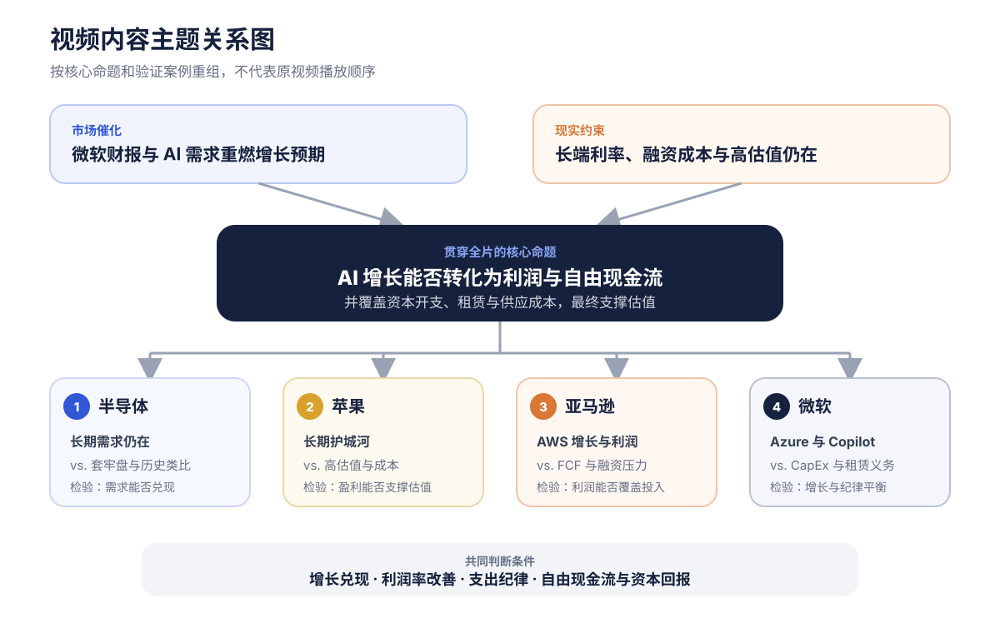
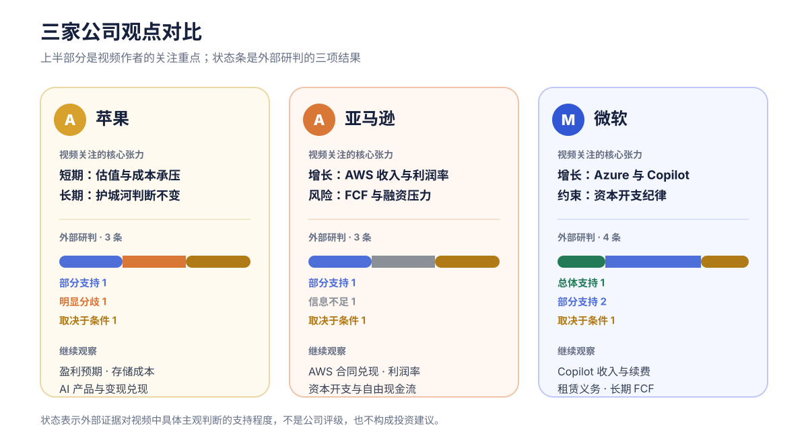
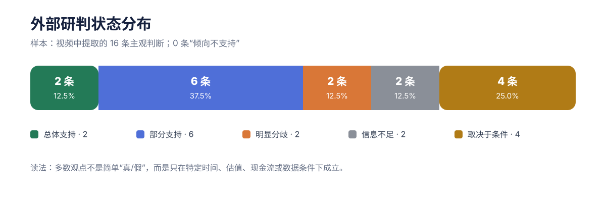
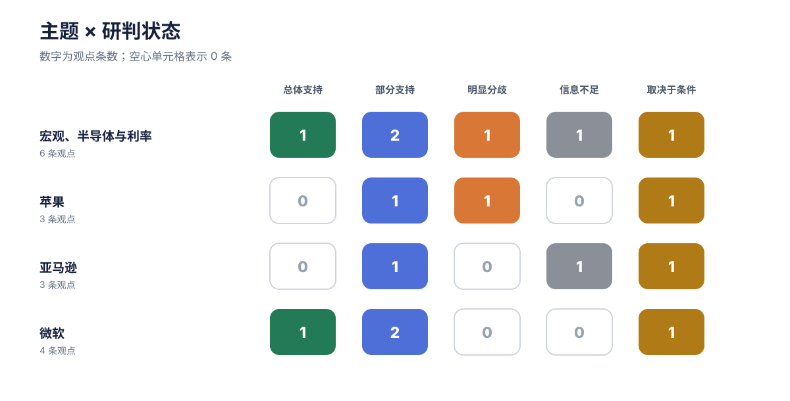

# AI增长能否穿过利率与现金流约束？

## Executive Summary｜30 秒读懂

- **这轮上涨更像财报驱动的修复。** 视频认为，微软财报重新点燃了 AI 交易，但长端美债收益率仍高，不能据此判断利率压力已经解除。[04:01–04:11](https://www.youtube.com/watch?v=Gr7j-YIyEQE&t=241s)
- **三家公司是三种不同的“增长—成本”张力。** 苹果是短期估值压力与长期护城河；亚马逊是 AWS 增长与自由现金流；微软是 Azure、Copilot 与资本开支纪律。
- **外部证据没有给出简单的是非答案。** 16 条主观判断中，2 条总体支持、6 条部分支持、4 条取决于条件、2 条存在明显分歧、2 条信息不足，没有“倾向不支持”。
- **真正需要跟踪的是兑现条件。** AI 需求能否变成收入和利润、资本开支与租赁义务是否压住现金流，以及高利率是否传导到融资与估值，决定这些判断能否持续成立。

> 正文先忠实整理视频作者的表达；外部信源形成的独立研判单独展示，不代表视频作者观点，也不构成投资建议。

<section class="metric-grid" aria-label="报告概览">
  
<strong>1 条</strong>贯穿全片的核心命题

  
<strong>16 条</strong>可追溯主观观点

  
<strong>4 组</strong>外部研判主题

  
<strong>41 个</strong>去重外部信源

</section>

<nav class="toc">
<strong>快速阅读</strong>
<ol>
<li><a href="#thesis">核心命题</a></li>
<li><a href="#companies">三家公司对比</a></li>
<li><a href="#evidence">外部证据怎么看</a></li>
<li><a href="#monitor">下一步跟踪什么</a></li>
<li><a href="#audit">限制与详细附录</a></li>
</ol>
</nav>

## 核心命题不是“AI还涨不涨”，而是增长能否覆盖成本 {#thesis}

把视频中的市场、半导体和三家公司讨论重新组合后，可以提炼出一条贯穿全片的命题：**微软财报让市场重新相信 AI 增长，但长端利率没有退场，因此增长最终仍要用利润、自由现金流和资本回报证明自己。** 这也解释了为什么视频一面看好半导体长期需求，一面提醒短期交易压力；一面肯定 AWS、Azure 和 Copilot，一面反复检查资本开支、租赁义务和融资成本。

该图按内容逻辑重组视频，不表示原视频的播放顺序。时间戳只在正文中作为原声证据入口。

四个主题不是并列新闻，而是同一问题的不同测试：半导体检验长期需求是否会被短期交易压力打断；苹果检验护城河能否承受高估值与成本；亚马逊检验 AWS 利润能否覆盖投入；微软检验 AI 增长与开支纪律能否同时成立。

作者的判断链条可以进一步压缩成五步：需求和产品采用只是起点，最终仍要穿过收入、支出、现金流和估值。

  
<strong>AI 需求</strong>采用、合同与算力需求

  
<strong>收入与利润</strong>增长能否兑现并改善利润率

  
<strong>支出与义务</strong>CapEx、租赁和供应成本

  
<strong>现金流与融资</strong>FCF 能否覆盖持续投入

  
<strong>估值与股价</strong>市场是否继续给予溢价

<strong>视频的核心提醒：</strong>增长与支出不是二选一。市场更可能奖励“增长兑现、利润率改善、开支有纪律、长期现金流可见”同时成立的公司。[20:21–21:19](https://www.youtube.com/watch?v=Gr7j-YIyEQE&t=1221s)

## 三家公司不能用同一把尺子衡量 {#companies}

苹果、亚马逊和微软面对的关键矛盾不同。图中的上半部分只概括视频作者的关注重点；状态条来自外部研判，不是股票评级。最值得比较的不是“谁更好”，而是每家公司的增长证据需要跨过什么成本与现金流门槛。

状态条统计每家公司对应的主观观点，不代表公司整体质量或预期回报。

  <article>
    <h3>苹果｜短期与长期分开看</h3>
    
<strong>视频观点：</strong>约 35 倍前瞻市盈率在增长放缓、成本压力和防御溢价回落时可能承压；但作者的五到十年持有框架不变，并称盘后小幅补仓。

    
<a href="https://www.youtube.com/watch?v=Gr7j-YIyEQE&t=499s">08:19–09:29 回看</a>

  </article>
  <article>
    <h3>亚马逊｜AWS 很强，FCF 是约束</h3>
    
<strong>视频观点：</strong>AWS 收入与利润率改善是最大亮点；同时，自由现金流、营运资金和未来融资成本决定高资本开支能否持续。

    
<a href="https://www.youtube.com/watch?v=Gr7j-YIyEQE&t=721s">12:01–15:00 回看</a>

  </article>
  <article>
    <h3>微软｜平衡感最受关注</h3>
    
<strong>视频观点：</strong>Azure 再加速、Copilot 使用增长和经营杠杆构成正面证据；租赁分类变化不能被误读为经济投入下降。

    
<a href="https://www.youtube.com/watch?v=Gr7j-YIyEQE&t=989s">16:29–21:19 回看</a>

  </article>

## 外部证据更支持“有条件成立”，而非简单验证 {#evidence}

**本注为基于外部信源形成的独立研判，不代表视频作者观点。** 外部研究只处理视频中的主观判断、预测、因果推断、价值判断和建议；它不会静默改写作者原意。

总体上，50% 的观点处于“部分支持”或“总体支持”，另有 25% 取决于明确条件。其余 25% 分别是明显分歧和信息不足。这里的重点不是给观点打分，而是标出哪些前提已经有证据、哪些仍需持续验证。

分母为 16 条主观观点；完整逐条映射见详细版和 report-data.json。

按主题拆开后，宏观与半导体的状态最分散，说明“财报修复”和“长期需求仍在”有数据支撑，但投资者行为、历史走势类比和政治归因仍存在证据缺口。微软的四条观点中有一条总体支持、两条部分支持，证据组合相对更完整。

矩阵按宏观与半导体、苹果、亚马逊、微软四个研究主题汇总；空心格表示 0 条。

  <article class="assessment">
    <h3>宏观、半导体与利率</h3>
    
<strong>本注为基于外部信源形成的独立研判，不代表视频作者观点。</strong>

    
支持 1部分支持 2分歧 1不足 1有条件 1

    
当日科技股上涨而长端收益率仍高，支持“财报修复未解除利率压力”。但 SOX 与 2000 年的四个月线性类比缺少样本外检验；长端收益率也不能只归因于单一政治人物。

    
依据：<a href="https://home.treasury.gov/resource-center/data-chart-center/interest-rates/TextView?field_tdr_date_value_month=202607&amp;type=daily_treasury_yield_curve">美国财政部</a>、<a href="https://www.bea.gov/news/2026/gdp-advance-estimate-2nd-quarter-2026">BEA</a>、<a href="https://www.federalreserve.gov/publications/2026-may-financial-stability-report-overview.htm">美联储</a>。

  </article>
  <article class="assessment">
    <h3>苹果</h3>
    
<strong>本注为基于外部信源形成的独立研判，不代表视频作者观点。</strong>

    
部分支持 1分歧 1有条件 1

    
高估值、存储成本与供应约束会提高脆弱性；但当季收入、EPS、iPhone、Mac 和服务均增长，公开数据无法证明近期上涨主要来自防御资金。长期逻辑仍取决于产品、供货、定价与 AI 变现。

    
依据：<a href="https://www.apple.com/newsroom/2026/07/apple-reports-third-quarter-results/">Apple 财报</a>、<a href="https://www.sec.gov/Archives/edgar/data/320193/000032019326000020/aapl-20260627.htm">Apple 10-Q</a>。

  </article>
  <article class="assessment">
    <h3>亚马逊</h3>
    
<strong>本注为基于外部信源形成的独立研判，不代表视频作者观点。</strong>

    
部分支持 1信息不足 1有条件 1

    
AWS 增长与利润支持继续投资，但应收变化不足以单独证明客户付款恶化。上行空间要同时满足合同兑现、利润率维持、资本开支纪律和现金流改善。

    
依据：<a href="https://ir.aboutamazon.com/news-release/news-release-details/2026/Amazon-com-Announces-Second-Quarter-Results/">Amazon 财报</a>、<a href="https://www.sec.gov/Archives/edgar/data/1018724/000110465926072140/tm2613616d4_8k.htm">融资披露</a>。

  </article>
  <article class="assessment">
    <h3>微软</h3>
    
<strong>本注为基于外部信源形成的独立研判，不代表视频作者观点。</strong>

    
支持 1部分支持 2有条件 1

    
官方披露支持 Azure、云业务和租赁义务的方向性判断；Copilot 使用增长尚需进一步转化为续费、用量收入与净利润。长期奖励仍取决于利润率、自由现金流和资本回报。

    
依据：<a href="https://www.microsoft.com/en-us/Investor/earnings/FY-2026-Q4/press-release-webcast">Microsoft 财报</a>、<a href="https://www.sec.gov/Archives/edgar/data/789019/000119312526323660/R23.htm">Microsoft 租赁披露</a>。

  </article>

## 下一步只需盯住五个兑现条件 {#monitor}

**本注为基于外部信源形成的独立研判，不代表视频作者观点。** 与其追逐每次股价波动，更有用的是持续更新以下五个观察点：

1. **长端利率：** 是否继续高企，并开始通过再融资、信用利差或折现率压制高估值公司。
2. **AI 收入：** Azure、AWS 与 Copilot 的需求是否转化为可持续收入，而不是只停留在合同、用户数或算力预订。
3. **利润率：** 新增容量和产品采用能否覆盖折旧、租赁、芯片和电力成本。
4. **自由现金流：** 亚马逊和微软的资本投入是否换来经营现金流与长期 FCF 改善。
5. **苹果产品兑现：** 秋季产品、供应、价格弹性和 AI 变现能否支持当前盈利与估值预期。

## 仍可能改变结论的问题

- 本轮半导体投资者的真实持仓成本和卖出行为，是否支持“套牢盘”判断？
- 亚马逊应收账款的客户构成、账龄和坏账趋势，能否验证付款恶化推断？
- Copilot 的使用增长有多少转化为续费、增量席位、用量收入和净利润？
- 苹果的 AI 功能和服务能否在不明显伤害毛利率的前提下形成可见变现？

## 限制与详细附录 {#audit}

- 原始视频和音频是最高优先级信源；正文先于外部研究完成，并通过不读取外部研判的忠实性审查。
- 本地 ASR 共 671 个时间段，覆盖约 99.84% 音频；片头快口播、少数英文专名、微软租赁术语及尾部密集数字仍有回听风险，因此本版避开不确定逐字引语和精确远期数字。
- 视频中的一般数据、人名和日期未做全面事实核查，不应理解为已证实准确。外部资料访问于 2026-08-01，估值结论会随价格、预期和时间变化。
- 为减少默认页面文字量，16 条观点索引、完整外部研判、全部一级信源和详细方法已移到长版附录。

  <strong>可追溯材料</strong>
  <ul>
    <li><a href="report-detailed.md">完整详细版 Markdown</a></li>
    <li><a href="report-data.json">16 条观点与研判的结构化数据</a></li>
    <li><a href="citations.json">41 个去重外部信源</a></li>
    <li><a href="../../work/Gr7j-YIyEQE/video-analysis.json">视频章节与内容分析</a></li>
    <li><a href="../../work/Gr7j-YIyEQE/transcript/transcript.md">带时间戳转录</a></li>
  </ul>

