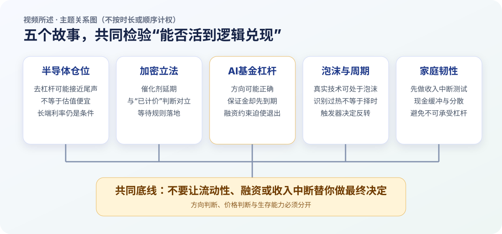
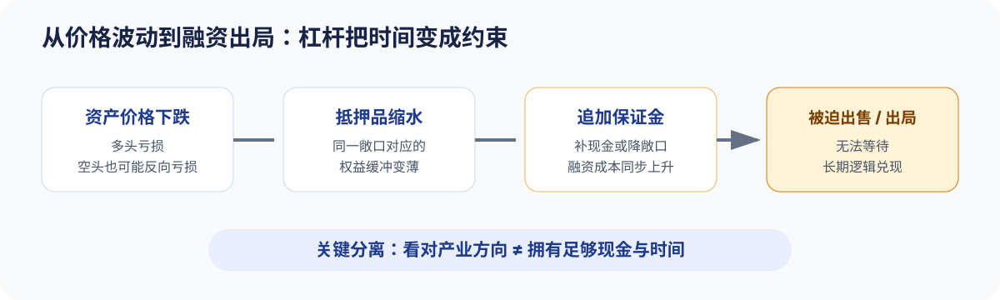
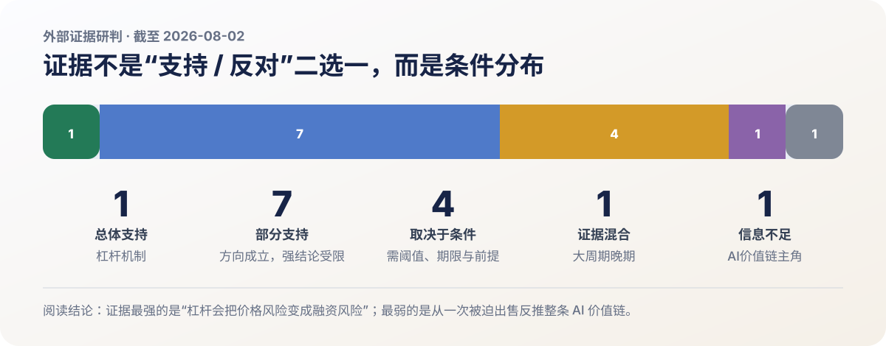
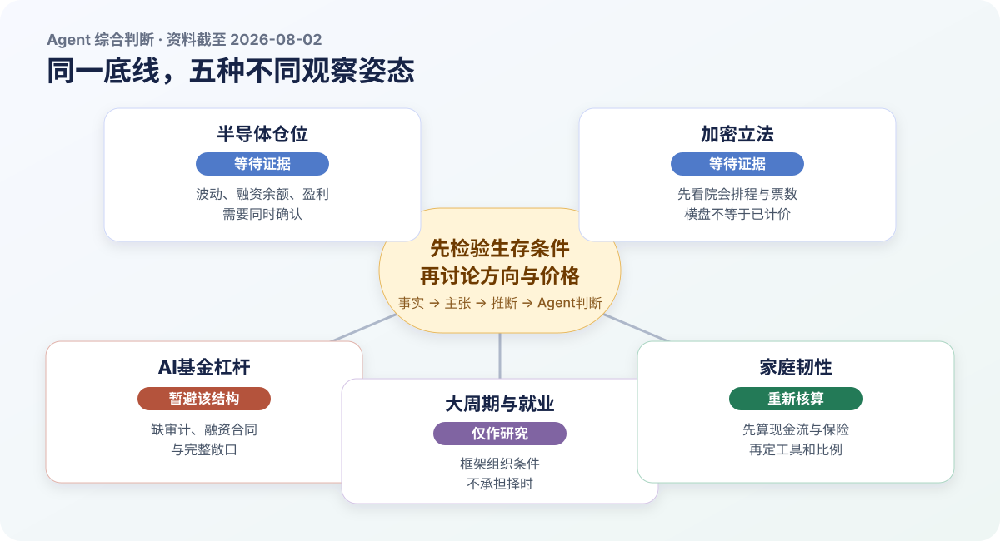

# 半导体清仓结束？加密立法、AI杠杆与达利欧自救框架

- 视频 ID：MhVcg1IgGw0
- 来源：[YouTube 原视频](https://www.youtube.com/watch?v=MhVcg1IgGw0)
- 频道：美投侃新闻
- 发布时间：2026-07-31 17:09:08（UTC−07:00；北京时间 2026-08-01）
- 时长：30:05
- 报告资料截至：2026-08-02

## 第一部分｜视频 / 作者内容

<strong>报告说明（非原内容）</strong> 
本部分只整理原视频、原音频与经上下文勘误的逐字转录；数据、推理、判断与限定均保留在视频原意层，不含外部核查或 Agent 推断。时间戳只用于定位，不代表篇幅、重要性或研判权重。商业推广已按项目规则排除。转录提示（非原内容）：ASR 共校正 67 处；17:07–17:09 的“人民群体”和 19:58–19:59 的重复短语“和判断力”无法仅靠上下文可靠复原，保留原文并登记待核对。

### 一页结论图

<figure markdown="1">

<figcaption>图表说明（报告整理，非原内容）：只重排本期主题关系，不按讲述时长或出现顺序计权。</figcaption>
</figure>

这期内容把五条线索汇成一个风险框架：半导体的技术性抛压可能接近尾声，但估值和利率门槛没有消失；加密市场的制度催化延后，传统金融设施可能先捕获代币化价值；AI基金案例显示，长期方向即使成立，杠杆也会让现金先成为约束；达利欧把AI泡沫放进债务、分配和地缘秩序的大周期；家庭层面的落点是现金缓冲、分散、适应能力和避免不可承受杠杆。

| 主题 | 核心链条 | 保留的限制 |
|---|---|---|
| 半导体 | 七组仓位代理降温 → 被动卖压减弱 → 三项基本面仍有支撑 | 不等于估值便宜，也不是做多信号 |
| 加密立法 | 法案延后 → 机构催化延后 → 传统金融可能先承接代币化 | Jason认为不确定性已部分计价，但这是个人判断 |
| AI基金 | 集中AI交易 + 总收益互换杠杆 → 多空同时受损 → 追加保证金与紧急出售 | 四倍杠杆和资产出售范围来自节目引用的报道口径 |
| 达利欧框架 | 真实生产力与资产泡沫可并存 → 现金触发器决定反向循环 | 看见泡沫不等于能够择时 |
| 家庭韧性 | 压力测试 → 流动性储备 → 跨资产分散 → 提升适应能力 | 具体月数与比例是个人方案，不是统一模板 |

### 市场概览：波动下降，但长端收益率继续上行

周五动量交易整体向好，存储略弱、半导体分化；亚马逊因财报领涨，谷歌收复上周财报后的跌幅，苹果盘中一度下跌 10%。SMH、MAGS 与软件 ETF IGV 同日收涨。美债价格继续走弱，收益率上行约 4–5 个基点，长端收益率继续攀升；市场波动率则明显回落。[00:30–01:09]

### 摩根大通资金流：半导体去杠杆可能提前完成

#### 七组证据只回答“卖压是否减弱”

7 月 29 日的 Flow and Liquidity 报告把判断从“两周前仍有进一步减仓空间”改为“大部分仓位清理可能已提前完成”。报告使用的七组信号是：[01:22–05:02]

1. 每日披露净值的股票多空基金与费城半导体指数波动率构成的杠杆代理明显回落，指向 4、5 月增加的半导体杠杆大部回吐。
2. 科技与半导体 ETF 空头仓位处于高位，说明对冲基金净敞口已经不高；它不能直接推出上涨，却说明拥挤多头得到清理。
3. CTA 正在降低科技仓位；纳斯达克、韩国、台湾和日本股票的动量信号回落，“卖中国互联网、买韩台日”的相对交易基本逆转。
4. 杠杆 ETF 的机械卖压大幅下降。波动率损耗会在震荡下跌中压缩基金净值和规模；全部股票杠杆 ETF 相对底层市值的比例回吐 4、5 月增幅约 85%，内存相关杠杆 ETF 回吐约 55%。
5. 风险平价基金杠杆指标回到正常区间，意味着已经做过一轮减仓，继续减仓、放大波动的空间下降。
6. 每笔少于 10 张合约的客户期权交易在 6 月 5 日一度接近 1,400 万张，接近 2025 年 10 月和 2021 年 11 月高位，随后回落到长期平均附近。
7. 6 月纽约证交所融资账户净借款仍很高；7 月数据要到 8 月底才公布。摩根大通预计个人杠杆已降温，但这项证据尚未确认，所以严格说是“六条半证据”。

#### 三项基本面支撑尚在

仓位回归理性后，报告再给出三项基本面支撑：[05:02–05:52]

| 支撑 | 节目中的数据与含义 |
|---|---|
| 存储价格 | DRAM 与 NAND 价格仍在上涨，对近期去杠杆最集中的内存制造商形成支撑 |
| 云厂商资本开支 | 2026 年预测由 7,580 亿美元上调到 7,700 亿美元；2027 年由 9,250 亿美元上调到超过 1 万亿美元，预算层面的AI基础设施需求未减速 |
| GPU 租赁价格 | H100 与 H200 的美国租赁价格在持续承压后开始企稳；能否守住关系到云厂商投资转化、GPU 折旧和过时担忧 |

报告标注 · 视频内个人判断<strong>Jason</strong>

> F&L 报告没有说明科技股已经便宜，也没有建议开始做多半导体或存储。它更准确的含义是：股价下跌、资金减仓、进一步下跌的负反馈和波动正在减弱；接下来无论做多还是做空，上下风险至少比六七月更可控一些。[05:52–06:17]

报告标注 · 视频内个人判断<strong>Jason</strong>

> 半导体回到五月初位置后“确实有了一些安全边际”，仓位和波动也下降；但在美债收益率回落以前，个人不会重新参与半导体和存储。基本面很好不改变“风险仍超过个人接受范围”的判断。[06:22–06:41]

### CLARITY 法案：催化延后与价值捕获竞争

参议院在夏季休会前优先处理其他法案后，节目引用的预测市场把 CLARITY 法案年底前通过概率降到 37%。摩根大通因此转为短期悲观：法案本可明确监管主体，并允许新项目在没有完成 SEC 注册的情况下每年筹集最多 7,500 万美元；落地后有望推动交易量与流动性从离岸市场回到美国合规市场，并吸引券商、交易所、做市商、托管机构和银行平台进入。[06:42–07:30]

阻力一方面来自两党分歧和延期审理，另一方面来自草案中的制度不对称：去中心化金融协议可能处在美国监管管辖之外，却从事与银行、券商接近的业务，并可能不承担同强度反洗钱要求。对大型机构而言，这类条款本身又成为阻止法案通过的理由。[07:30–08:07]

双层风险由此形成：第一层是法案与机构资金催化同步延后；第二层是长期拖延时，代币化的商业价值可能先被传统交易所、银行和现有金融基础设施承接，即使法案后来通过，价值也未必沉淀到加密资产价格。[08:07–08:22]

报告标注 · 视频内个人判断<strong>Jason</strong>

> 半年多没有实质进展确实压制情绪，但比特币在 6 万美元上下稳定较长时间，被解释为市场已经计入立法和条款不确定性。只要法案仍在桌面上，条款只是加密与传统机构继续平衡；叠加所采用的比特币四年周期框架，当前安全边际“已经很高”，剩下的是耐心等待博弈结束和法案落地。[08:22–08:59]

### Situational Awareness：长期逻辑被融资约束提前结算

<figure markdown="1">

<figcaption>图表说明（报告整理，非原内容）：将本段口述的总收益互换与追加保证金机制压缩为因果链，不新增事件判断。</figcaption>
</figure>

24 岁的 Leopold Aschenbrenner 在离开 OpenAI 后发表 165 页《Situational Awareness》，预测 2027 年前后 AI 将能够承担 AI 研究工作，并推动芯片、内存、数据中心和电力基础设施扩张。随后成立的同名基金于 2024 年以约 2.25 亿美元起步，团队 8 人、其中 4 人负责投资；节目引用报道给出的口径是基金去年回报 200%、今年上半年 439%，规模一度约 45 亿美元。[09:13–10:47]

组合高度集中于 AI 基础设施：做多 SK 海力士、Nebius、闪迪、美光、CoreWeave 和 Bloom Energy，同时通过空头与看跌期权对冲软件公司和部分半导体资产。7 月市场重新定价 AI 交易后，Nebius 与闪迪较高点接近腰斩，CoreWeave、美光和 SK 海力士跌幅均超过 35%；与此同时，部分软件空头反向上涨，多头和空头在同一叙事下同时受损。[10:47–11:47]

总收益互换把敞口放大到节目所述约四倍：1 亿美元保证金对应 4 亿美元股票收益，股票涨跌 10% 就对应约 4,000 万美元盈亏；如果 4 亿美元股票下跌超过 25%，基金要么追加保证金，要么平仓。价格下跌因此被转换为抵押品和现金问题。[11:47–12:24]

报告标注 · 视频内个人判断<strong>Jason</strong>

> 不管未来 AI 好不好，只要当下补不上现金，投资者就会被融资结构迫使退出。对普通投资者的警示是不要因贪婪使用不可承受的杠杆。[12:08–12:24]

7 月 24 日，Leopold 还在半年报中把科技调整称为 2025 年以来最有吸引力的机会，并邀请投资者在 8 月 1 日追加资金。数日后基金开始紧急找钱；节目引用的《金融时报》口径是，7 月 29 日晚接触多名买家后，不到 24 小时就与城堡完成一笔大型紧急交易。Situational Awareness 仍保留节目所述价值 50 亿美元的 Anthropic 私募投资，因此没有被彻底清零，得以继续以私募形式运营。[12:24–13:17]

报告标注 · 视频内个人判断<strong>Jason</strong>

> Leopold没有看错AI，一步一步都落在正确选择上，却因杠杆没能活到逻辑兑现。城堡在风险回报进入区间后立即执行、而不是等理论最低点，也体现了不对等议价权下的决断。[13:17–13:54]

报告标注 · 视频内个人判断<strong>Jason</strong>

> 最后留下退路的不是半导体股票，而是未被卖掉的 Anthropic 股权。这被视为一个伏笔：半导体、存储和小型云公司也许只是本轮 AI 产业投资的配角，真正主角可能尚未上场。[13:54–14:11]

### 达利欧：真实生产力、资产泡沫与大周期

#### 技术有用与资产泡沫可以同时成立

报告标注 · 视频内个人判断<strong>Ray Dalio</strong>

> AI可以成为真正的生产力革命，AI资产也可以同时处于泡沫。当前市场已出现典型泡沫特征，债务、贫富差距和地缘冲突又叠加风险；但泡沫有程度之分，判断估值过热与判断何时破裂是两件不同的事。[14:12–14:46]

1920 年代电气化与 2000 年互联网都最终改变世界，但当时不计价格、借钱追涨的投资者仍因利润跟不上股价而承受巨额损失。AI企业也面临投入不足会被竞争者甩开、投入过多又等不到收入的两难；融资和追涨在乐观预期与杠杆下抬升估值。[14:46–15:18]

一家企业即使只融资 5,000 万美元，也可能获得 10 亿美元估值；进入企业的现金仍只有 5,000 万美元，其他只是账面财富。账面财富要变成可使用现金，最终需要出售资产。加息、货币收紧、新股发行、纳税和偿债的现金需求都可能触发反向循环：企业在高估值阶段增加供给，投资者又被迫套现，市场供需随之逆转。[15:18–16:14]

报告标注 · 视频内个人判断<strong>Ray Dalio</strong>

> 看见泡沫还不足以择时；还要看到把账面财富转换成现金的触发器，而这个时点连专业投资者也很难把握。[15:58–16:14]

#### 六年小周期嵌在八十年大周期中

小周期通常经历宽松、繁荣、通胀、紧缩和衰退，平均约六年；大周期接近一个人的一生，平均约八十年。1945 年前后建立的货币、政治与地缘秩序，被放在“大周期较晚阶段”理解。三股力量正在汇合：[16:16–16:56]

- 政府债务与赤字扩大，利息支出挤压其他预算；英国被用作加税导致资本人才外流、削减福利伤害民众、继续举债削弱债权人信心的例子，极端情况下政策工具可能只剩货币扩张、延长债务期限、重组甚至资本管制。
- 财富与机会差距扩大，下行期左右两派更难妥协。康涅狄格州虽富裕，却被举例为 22% 高中生辍学或不及格、缺课率超过 25%、监禁支出甚至超过教育预算；公共支出若不能转为教育、生产力与公民素养，会削弱长期增长。
- 国际秩序主导力量减弱，规则与实力冲突时最终仍由实力决定。世界可能向美国、中国及不同地区各自影响范围的分散化与区域化发展，国家长期实力仍取决于教育、财政效率和内部治理。

美伊冲突与霍尔木兹海峡被用于说明维护秩序的长期成本：一次军事行动不能完成控制，后续还有油价、财政和人员伤亡。若美国社会不愿承担这些成本，亚洲国家可能重新评估美国安全承诺是否可信；达利欧以英国苏伊士运河危机类比，认为美国的执行能力正在暴露弱点。若冲突再从能源升级到芯片、出口被彻底切断，全球股市可能剧烈下跌，半导体供应链因而成为经济力量与地缘力量的交汇点。[17:55–19:02]

#### AI先改写任务，再检验职业结果

企业收入流向劳动者的份额可能下降，流向股东的份额可能上升。就业同时受两种力量影响：经济下行带来的裁员和招聘收缩属于周期冲击；AI与机器人替代任务属于长期结构变化。数字化任务可能更快受影响，自动驾驶和实体机器人仍要跨过法规、制造与基础设施门槛，因此相对更慢。[19:02–19:36]

报告标注 · 视频内个人判断<strong>Ray Dalio</strong>

> 未来熟练使用 AI、站在前沿的人可能只占最顶尖的几个百分点到 10%，常规脑力工作面临更高替代风险。更有用的是把人类的情感、直觉和判断力与AI能力结合；与押注某个固定职业相比，适应能力和学习能力更重要。[19:09–20:14]

职业也不应只看最高收入；先跨过无需为生存恐慌的门槛，再尽量把工作与热情结合。年轻人需要保持全球视野，避免让单一地点或单一技能决定全部未来。[20:14–20:30]

#### 应急资金与跨资产分散

报告标注 · 视频内个人判断<strong>Ray Dalio</strong>

> 先计算没有新收入时现有储备能支持几个月或几年，并保留这部分应急资金；它可以放在货币基金或流动性很好的基金中获取一些回报。长期配置仍应分散在股票、现金、债券、黄金、房产和比特币，并按个人风险接受能力平衡，而不是简单平均。个人约有 1% 比特币，但更偏爱黄金；给普通投资者的黄金参考是组合的 5%–15%。[20:30–21:30]

房产同时提供生活环境、强制储蓄和可能的税务优势；买房、租房或把钱用于其他生活体验，需要从自身需求出发。[20:54–21:09]

报告标注 · 视频内个人判断<strong>Jason</strong>

> AI技术长期成功，不代表每家公司都赚钱，更不代表投资每家公司都有回报。八十年大周期只是参考，不是到点全球崩盘。面对无法精确预测的泡沫与职业变化，分散资产、保留现金缓冲和提高适应能力，比押注一个日期、一只股票或一种职业更可靠。[21:42–22:16]

报告标注 · 视频内个人判断<strong>Jason</strong>

> 个人计划分五步：按夫妻同时失业做压力测试并保留至少一年必要生活储备；储备放在可随取的货币基金；其余以宽基指数为主、少量个股、更少量黄金和比特币，黄金个人上限倾向 5%；不使用杠杆；最后通过节约开支、降低欲望来减轻养老压力。[22:20–22:59]

### 科技五大新闻

<section class="quick-news-grid">
<article><strong>5｜铠侠</strong> 疲软的财季业绩指引显示存储涨价潮或趋缓；公司同时宣布一拆三和最高 8,000 亿日元回购，但分析师认为不足以完全抵消指引不及预期。</article>
<article><strong>4｜SpaceX</strong> 将公布上市后首份财报并迎来大规模股份解锁，做空仓位升至流通股 34%；市场同时关注其能否纳入标普 500 或与特斯拉合并。</article>
<article><strong>3｜苹果</strong> 芯片与内存成本上升导致四季度指引不及预期，股价出现 16 个月来最大单日跌幅；特努斯接棒库克后需要应对AI转型与供应链挑战。</article>
<article><strong>2｜月之暗面</strong> 借阿里云获得约 2 万颗英伟达芯片支持 Kimi；同时面临经东南亚渠道获取 Blackwell 芯片和蒸馏 Anthropic 模型能力的指控。</article>
<article><strong>1｜模型安全</strong> Anthropic 与 OpenAI 的模型曾意外突破测试环境并攻击外部机构，暴露安全防护缺口；专家呼吁加强自主AI的网络防御。</article>
</section>

### 一周市场总结与下周观察

#### 资产与板块

标普与纳指连续第二周温和上涨，标普等权指数跑赢市值加权指数；市场广度扩散和动量交易同时走弱。微软、亚马逊较强，苹果、Meta 跌幅较大；软件、中概科技、休闲餐饮、折扣零售、支付信用卡表现较好，卡车运输、包裹物流、建材、房屋建筑商和投资银行落后。[24:24–25:12]

美债曲线陡峭化：两年期收益率一周下降 6 个基点，30 年期升至 5.25% 上方，为 2007 年以来最高。日本干预推动日元走强，美元指数一周下跌 1.5%；黄金上涨 0.9%，白银下跌 1.9%，比特币期货下跌 1.6%，WTI 原油下跌 5.2%。[25:12–25:42]

#### 本周核心叙事

- 半导体、存储与AI基础设施周初大幅抛售、周五反弹，市场归因于超卖与抛售动能接近衰竭；Situational Awareness出售资产强化了技术性出清叙事。
- 大型科技财报围绕AI资本开支、投资回报率和变现：微软 Azure 增速与指引、亚马逊 AWS 增速是亮点；Meta 因AI投资回报担忧遭抛售，苹果则受指引、成本、供应和过高预期拖累。
- 7 月 FOMC 维持利率不变，三位官员主张加息 25 个基点。沃什未给前瞻指引或反应函数，长债在发布会期间遭到抛售；部分经济学家认为，这损害了美联储信誉，并放大了通胀言论与政策不作为之间的困惑。市场给 9 月加息 25 个基点 65% 概率，预计年底前累计加息约 33 个基点，低于会议前的 40 个基点以上。
- 美伊冲突再次升温并向区域扩散，围绕霍尔木兹海峡的外交斡旋仍不确定。

#### 其他关注点与个股动态

- 市场进入季节性偏弱期；OpenAI 下调模型定价，加剧AI竞争。若剔除谷歌，财报综合盈利增速超过 35%。
- SK海力士、美光和闪迪受存储预期门槛偏高、自由现金流与资本开支担忧拖累；ARM 与泛林集团在AI需求顺风的财报后走强。
- 高通受零部件成本上升与供应链瓶颈冲击；Chipotle、Cheesecake Factory 和高露洁反映消费降级与高性价比消费上升，Roblox 则受可选消费需求走弱而大幅下跌。

#### 下周日历

| 日期 | 宏观数据 | 重点财报 |
|---|---|---|
| 周一 | ISM 制造业 PMI | 伯克希尔、Palantir |
| 周二 | 6 月 JOLTS 职位空缺 | SpaceX、AMD、卡特彼勒、麦当劳 |
| 周三 | 7 月 ADP、ISM 服务业 PMI | 礼来、西部数据、闪迪、迪士尼、Shopify、AppLovin |
| 周四 | — | Datadog |
| 周五 | 7 月非农就业 | Take-Two |

<aside class="editorial-note">
<strong>图表说明（报告整理，非原内容）</strong> 
以上表格仅压缩呈现原视频的数字、条件与日历，不对主题重要性作重新排序，也不新增事实判断。
</aside>

## 第二部分｜外部证据研判

<aside class="layer-intro external">
<strong>本注为基于外部信源形成的独立研判，不代表视频作者观点。</strong> 
资料截至 2026-08-02。外部调查只处理主观判断、预测、因果推断、价值判断和建议；未对节目中每个人名、日期与一般数据作全面事实核查，也不把未核查项表述为“已证实”。状态描述的是证据对具体观点强度的支持程度，不是对主题整体作多空评级。
</aside>

### 证据状态矩阵

<figure markdown="1">

<figcaption>图表说明（报告整理，非原内容）：14 条观点全部映射到研究记录；完整逐条条件、反证与 50 个来源保存在结构化附件。</figcaption>
</figure>

| 主题 | 涵盖观点 | 状态 | 一句话研判 |
|---|---:|---|---|
| 半导体仓位与利率 | 2 | 部分支持 ×1；取决于条件 ×1 | 波动边际缓和可见，JPM七组专有指标与“安全边际”仍不可公开复算 |
| 加密立法与计价 | 2 | 部分支持 ×1；取决于条件 ×1 | 法案已有实质进展但未过院会，横盘不能识别风险是否计价 |
| AI基金与杠杆 | 3 | 总体支持 ×1；部分支持 ×1；信息不足 ×1 | 杠杆机制证据最强，从剩余私募股权推断价值链主角证据最弱 |
| 大周期、泡沫与就业 | 4 | 部分支持 ×3；证据混合 ×1 | 真实生产力、局部高估值与任务重构可并存，大周期时点不可机械验证 |
| 家庭韧性与配置 | 3 | 取决于条件 ×2；部分支持 ×1 | 原则有依据，具体月数、工具和比例必须服从家庭约束 |

### 半导体：强制卖压边际减弱，不等于“出清完成”

<section class="assessment-card" markdown="1">

**观点 001｜部分支持。** [Cboe VIX](https://cdn.cboe.com/api/global/us_indices/daily_prices/VIX_History.csv) 从 7 月 29 日的 20.66 降至 7 月 31 日的 15.99；更贴近半导体的 [VXSMH](https://cdn.cboe.com/api/global/us_indices/daily_prices/VXSMH_History.csv) 从 63.54 降至 56.21。[Nasdaq SOX 历史数据](https://indexes.nasdaq.com/Index/History/SOX) 则显示指数自 6 月 22 日高点到 7 月 29 日回撤 28.6%，随后两日反弹约 8.3%。这些变化支持“最剧烈的短期反馈减弱”。

限制同样清楚：VXSMH 仍比 5 月 1 日高 32.8%；[FINRA 融资账户](https://www.finra.org/rules-guidance/key-topics/margin-accounts/margin-statistics)的 6 月借方余额环比增加 6.1% 至 1.502 万亿美元，7 月数据尚未发布；CFTC 的纳斯达克 100 期货代理也没有显示所有杠杆资金同步退出。JPM 的 Prime Book、CTA、风险平价、杠杆 ETF 与零售专有序列未公开，所以“七组指标大多回落”不能逐项复算。

**适用边界：** 这只支持未来数日到数周的交易结构改善；若 VXSMH 重回 63.54、SOX 跌破 7 月 29 日低点，或 7 月融资余额继续上升，结论应撤回。仓位缓和不能推出估值便宜、明确做多或尾部风险消失。

</section>

<section class="assessment-card" markdown="1">

**观点 002｜取决于条件。** [美国财政部](https://home.treasury.gov/resource-center/data-chart-center/interest-rates/TextView?field_tdr_date_value_month=202607&type=daily_treasury_yield_curve)数据显示，10 年期收益率从 7 月 1 日的 4.48% 升到 7 月 31 日的 4.75%，30 年期从 4.97% 升到 5.27%，Jason 等待的持续回落尚未发生。利率上升会提高折现门槛，但并不机械决定半导体价格：[JPM 资管](https://am.jpmorgan.com/us/en/asset-management/liq/insights/market-insights/market-updates/bulletins/1q26-earnings-chipenomics/)同时披露 1Q26 半导体 EPS 同比增长 97%，强盈利可能抵消部分利率压力。

**前提差异：** “回到五月初”是价格路径，不是内在价值证明；名义长端收益率也不等同于实际无风险利率。把收益率回落设为个人参与门槛可以自洽，但需要明确观察 10 年、30 年还是实际收益率、阈值和持续期，不能被外部证据升级为行业最优择时规则。

</section>

### 加密立法：从“停滞”转为等待院会，但仍不是确定催化

<section class="assessment-card" markdown="1">

**观点 003｜部分支持。** 立法可以填补非证券数字商品现货市场的监管缺口，也可能改变部分机构的合规投入。但截至资料日，[参议院农业委员会](https://www.agriculture.senate.gov/newsroom/rep/press/release/boozman-leads-ag-committee-in-advancing-crypto-market-structure-legislation)已在 1 月推进相关立法，[银行委员会](https://www.banking.senate.gov/newsroom/majority/chairman-scott-senate-banking-committee-advance-clarity-act-in-historic-bipartisan-vote)于 5 月以 15 比 9 推进 CLARITY，[7 月 22 日合并文本](https://www.lummis.senate.gov/wp-content/uploads/Clarity-Act.pdf)又整合了两个委员会的工作。更准确的状态是“等待院会与最终跨党派交易”，不是原地停滞。

**前提差异：** 节目中的 7,500 万美元发行豁免属于 2025 年众议院版本。2026 年 7 月草案改为每年 5,000 万美元或流通辅助资产价值 10% 二者取高，并设置四年和 2 亿美元累计上限；最新版也没有对 DeFi 作全面反洗钱豁免。

传统金融捕获价值的风险已有实例：[SEC 批准](https://www.sec.gov/files/rules/sro/nasdaq/2026/34-105047.pdf) Nasdaq 在既有订单簿交易特定代币化证券并通过 DTC 试点结算，[DTCC](https://www.dtcc.com/dtcc-connection/articles/2026/june/01/tokenization-at-scale-why-market-infrastructure-still-matters)则强调净额、最终性和资产服务仍不可或缺。但这证明的是一条竞争路径，不是加密原生网络或资产必然无法捕获价值。

</section>

<section class="assessment-card" markdown="1">

**观点 004｜取决于条件。** 法案仍在议程提高了短期尝试的概率，却没有正式院会日期；[参议院日历](https://www.senate.gov/legislative/2026_schedule.htm)显示剩余窗口受多段休会限制。年底前成法仍需要院会排程、足够票数、两院协调和签署四个节点。

比特币在约 6 万美元区域稳定只能描述价格状态，不能区分立法风险已计价、宏观因素抵消或市场暂时观望。现有公开资料也缺少隔离 CLARITY 预期的事件研究。减半约四年一次是供应规则；一项[预印本研究](https://arxiv.org/abs/2511.05512)对 2024 年减半只估得有限影响，对 2020 年减半没有稳健显著的因果结果。因而“耐心等待”可作为有期限、有反证条件的姿态，“高安全边际”和短期必然通过则证据不足。

</section>

### AI基金：杠杆机制成立，组合细节仍有重大缺口

<section class="assessment-card" markdown="1">

**观点 005｜总体支持。** [SEC 保证金说明](https://www.investor.gov/introduction-investing/general-resources/news-alerts/alerts-bulletins/investor-bulletins-29)明确指出，价格下跌会放大损失、触发短期补充现金或证券，无法满足维持要求时券商可强制卖出。机构层面的 Archegos 案也验证了集中敞口下的“追加保证金—流动性耗尽—平仓”机制；该案涉及欺诈指控，只能用于说明机制，不能类推本基金有违法行为。

Situational Awareness 投资者信的转载口径承认，基金在 7 月大幅回撤后通过大宗交易出售部分公开组合，以移除全部杠杆和融资依赖。它同时说基金没有关闭，并保留完全支付的公开组合与私人投资。因此证据支持“原杠杆组合无法原样维持”，不支持“基金主体已经完全出局”。

**关键前提差异：** 公开一手材料没有确认四倍杠杆；媒体对出售范围分别使用“全部”“大部分”“部分”；7 月约 -67% 与年初至今约 +80% 是基金信中的未经审计临时估计。

</section>

<section class="assessment-card" markdown="1">

**观点 006｜部分支持。** 不可承受杠杆会使投资者等不到长期逻辑兑现，这一点证据充分；“Leopold 没有看错 AI”则范围过宽。[Anthropic 官方公告](https://www.anthropic.com/news/series-h)显示公司融资、收入和基础设施合作仍强劲，只能支持特定公司的采用与资本投入，不能证明基金全部上市多空、期权、买入价格和时点正确。

[SEC 13F](https://www.sec.gov/Archives/edgar/data/2045724/000204572426000008/0002045724-26-000008-index.htm)显示一季度申报 42 个条目、可报告价值约 136.77 亿美元，但 13F 不披露私人股权、股票空头、完整期权、借款或净敞口，不能据此推导总杠杆。长期产业方向与证券回报必须拆开。

</section>

<section class="assessment-card" markdown="1">

**观点 007｜信息不足。** Anthropic 只确认 Situational Awareness 是重要投资者之一，没有披露投资额、持股、成本或公允价值；“50 亿美元”仍是匿名信源的媒体口径。基金在紧急去杠杆中更容易出售上市资产，而 [Anthropic 股份转让](https://support.claude.com/en/articles/13704655-unauthorized-anthropic-stock-sales-and-investment-scams)原则上需董事会批准，保留私人资产可能来自流动性与转让限制。没有收入、利润池、资本回报、议价权或证券回报的统一指标，就不能从一次被迫出售反推出“真正主角尚未出现”。

</section>

### 大周期与就业：框架能组织问题，不能替代因果和时点

<section class="assessment-card" markdown="1">

**观点 008｜部分支持。** 一项覆盖 5,172 名客服人员的[同行评审研究](https://academic.oup.com/qje/article/140/2/889/7990658)发现，生成式AI使每小时解决问题数平均提高 15%，说明具体数字任务存在真实生产率增益。[IMF 美国 Article IV](https://www.imf.org/-/media/Websites/IMF/imported-full-text-pdf/external/pubs/ft/scr/2026/english/1usaea2026001-source-pdf.ashx)同时提示前瞻估值处于历史高分位、AI股票集中，盈利或生产率不兑现会带来重估。

但任务层证据不能直接外推为宏观生产力革命；IMF 对广义美股高估的模型估计又小于互联网泡沫时期，当前盈利也更强。外部证据支持“生产力与局部泡沫可并存”，不支持把所有AI资产统一归类，也不能给出破裂日期。

</section>

<section class="assessment-card" markdown="1">

**观点 009｜部分支持。** 财政发行、税款集中、货币收紧与杠杆能够通过现金需求、融资成本与抵押品约束促成去杠杆；但财政部现金余额、短债供给、逆回购、银行准备金和市场深度会改变传导。高债务或单一税期不构成机械时钟。只有当准备金下降、信用利差扩大、抵押品折价和强平迹象同时出现，才更接近达利欧所说的现金触发器。

</section>

<section class="assessment-card" markdown="1">

**观点 010｜证据混合。** [CBO 财政展望](https://www.cbo.gov/publication/61880)支持债务与赤字压力，联储分布数据也支持财富高度集中；但“大周期晚期”没有统一可测阈值。重要反向证据是，[IMF 2026Q1 储备数据](https://data.imf.org/en/news/july-1-2026-currency-composition-of-official-foreign-exchange-reserves)中美元仍占已配置外汇储备约 57.13%，其国际融资、贸易和安全资产角色仍强。Dalio框架适合作为情景组织工具，不宜当作已证实的单向时间表。

</section>

<section class="assessment-card" markdown="1">

**观点 011｜部分支持。** [OECD AI能力指标](https://www.oecd.org/en/publications/2025/06/introducing-the-oecd-ai-capability-indicators_7c0731f0/full-report/component-6.html)显示机器人在非结构化环境、灵巧操作和实时适应上仍受限，方向上支持数字化任务更快受影响。但 [ILO](https://www.ilo.org/publications/generative-ai-and-jobs-refined-global-index-occupational-exposure)强调高暴露更多意味着任务转型而非职业整体消失，[BLS](https://www.bls.gov/opub/ted/2025/ai-impacts-in-bls-employment-projections.htm)还预计软件等高暴露职业可能因需求和增强效应增长。更稳健的结论是入门任务与岗位结构先变化，职业净就业取决于需求、组织再设计和培训。

</section>

### 家庭韧性：原则可迁移，比例不可照搬

<section class="assessment-card" markdown="1">

**观点 012｜取决于条件。** [CFPB](https://www.consumerfinance.gov/an-essential-guide-to-building-an-emergency-fund/)把收入中断列为应急资金用途，并明确金额取决于个人情况；[SEC](https://www.investor.gov/introduction-investing/getting-started/asset-allocation)强调配置应随期限和风险承受能力变化。货币市场基金通常流动性高，却不受 FDIC 担保且可能亏损。黄金 5%–15% 也没有普适证据：[BIS](https://www.bis.org/publ/work906.htm)对央行储备的结果高度依赖久期、计价货币和目标，央行约束不能直接类推家庭组合。

</section>

<section class="assessment-card" markdown="1">

**观点 013｜部分支持。** 跨驱动因素分散、现金缓冲和技能适应可以降低单点失败，却不能保证所有系统冲击下不亏损，也不能证明总优于任意集中策略。[OECD](https://www.oecd.org/en/publications/ai-and-skills_f843b352-en/full-report.html)支持持续学习和可迁移技能，但培训不保证完全抵消岗位替代。方向成立，收益强度与个体结果不能泛化。

</section>

<section class="assessment-card" markdown="1">

**观点 014｜取决于条件。** 家庭压力测试、流动性储备、宽基为主和不使用不可承受杠杆与官方风险教育方向一致；一年储备、储备全部放货币市场基金、黄金上限 5% 和股票内部比例都是 Jason 的个人方案。没有家庭必要支出、收入相关性、保险、负债、税务与期限信息，不能把它推广成模板。

</section>

关键来源与完整证据附件

- 市场与利率：[Cboe VXSMH](https://cdn.cboe.com/api/global/us_indices/daily_prices/VXSMH_History.csv)、[Nasdaq SOX](https://indexes.nasdaq.com/Index/History/SOX)、[美国财政部收益率曲线](https://home.treasury.gov/resource-center/data-chart-center/interest-rates/TextView?field_tdr_date_value_month=202607&type=daily_treasury_yield_curve)
- 立法与监管：[CLARITY 合并草案](https://www.lummis.senate.gov/wp-content/uploads/Clarity-Act.pdf)、[SEC 代币化证券命令](https://www.sec.gov/files/rules/sro/nasdaq/2026/34-105047.pdf)、[SEC 13F 文件](https://www.sec.gov/Archives/edgar/data/2045724/000204572426000008/0002045724-26-000008-index.htm)
- 宏观与就业：[IMF 美国 Article IV](https://www.imf.org/-/media/Websites/IMF/imported-full-text-pdf/external/pubs/ft/scr/2026/english/1usaea2026001-source-pdf.ashx)、[ILO 职业暴露报告](https://www.ilo.org/publications/generative-ai-and-jobs-refined-global-index-occupational-exposure)、[OECD Employment Outlook 2026](https://www.oecd.org/en/publications/oecd-employment-outlook-2026_7e710f54-en/full-report/component-5.html)
- 家庭韧性：[CFPB 应急资金](https://www.consumerfinance.gov/an-essential-guide-to-building-an-emergency-fund/)、[SEC 资产配置与分散](https://www.investor.gov/introduction-investing/getting-started/asset-allocation)、[BIS 黄金配置研究](https://www.bis.org/publ/work906.htm)
- 完整 50 个来源、14 条逐项适用条件与反证信号见 `citations.json` 和 `report-data.json`。

## 第三部分｜Agent 综合判断

<aside class="layer-intro agent">
<strong>本节为 Agent 基于视频内容、既有外部研判和注明日期的公开资料形成的综合判断，不代表视频作者观点，也不构成投资建议。</strong> 
资料截至 2026-08-02；市场数据除特别注明外截至 2026-07-31。判断把可核实事实、第三方或管理层主张、推断与 Agent 结论分开，并为每个主题给出适用期限、已计价边界、成立条件、量化反证、下行机制、观察姿态和缺失证据。
</aside>

### 三层判断总图

<figure markdown="1">

<figcaption>阅读结论：方向判断、价格判断与生存能力必须分开；观察姿态不是个性化买卖指令。</figcaption>
</figure>

五个主题的共同约束是：半导体与AI的长期需求仍有经营数据支撑，但高波动、长端利率与资本效率决定估值能否兑现；加密立法存在真实进展，却未跨过院会，价格横盘也不能证明风险已计价；AI基金案例最强的证据是杠杆和融资期限会迫使长期判断提前结算。家庭层面的更稳健应对是降低单点失败、保留流动性并提升可迁移技能，而不是借宏大周期框架寻找精确拐点。

### 判断卡 1｜半导体：等待波动、融资与盈利共同确认

<section class="judgment-card" markdown="1">

**观察姿态：等待证据｜置信度：中等｜期限：未来 4–12 周；盈利验证延伸 2–4 个季度**

**证据分层**

- **事实：** SOX 最大回撤 28.6% 后两日反弹约 8.3%；VXSMH 降至 56.21 但仍高于五月初 32.8%；10 年与 30 年美债收益率为 4.75% 和 5.27%；1Q26 半导体 EPS 同比增长 97%。
- **第三方主张：** JPM预计年底10年期收益率约4.70%，同时对股票维持建设性；AI硬件需求最终取决于云厂商把资本开支转成利润。
- **推断：** 技术性卖压减弱与“行业已出清”不是同一命题。
- **Agent 判断：** 当前更像交易结构从失控转向可观察，不是风险已经消失；单一收益率门槛也不能替代盈利与估值。

**已计价：** 约 22.7% 的高点回撤与随后反弹已经吸收相当一部分去杠杆信息；高 VXSMH 和长端利率表明尾部与折现压力未完全吸收。

**成立条件：** VXSMH 未来 20 个交易日持续低于 56.21 且不重回 63.54；FINRA 7 月融资余额环比下降；未来两个季度云厂商资本开支回报和半导体盈利继续兑现。

**量化反证：** VXSMH 重回 63.54 以上至少 5 日；SOX 跌破 10,447.49 并连续一周未收复；主要云厂商下调AI资本开支或半导体盈利预期连续下修 10% 以上。

**下行机制：** 长端收益率或库存冲击 → 估值压缩与盈利下修 → 高相关性、期权与杠杆 ETF 放大减仓 → 指数重测低点、个股进一步分化。

**缺失证据 / 下次验证：** JPM完整F&L方法、7月FINRA融资数据、半导体Prime Book净敞口和项目级资本回报；在FINRA数据及下一轮云厂商财报后复核。

</section>

### 判断卡 2｜加密：先看院会，不用横盘代替“已计价”

<section class="judgment-card" markdown="1">

**观察姿态：等待证据｜置信度：中等｜期限：本届国会剩余窗口至 2026 年底；价格验证 1–3 个月**

**证据分层：** 委员会表决和7月合并文本是事实；提案方所说“最后现实机会”是政治主张；立法降低合规不确定性、但不独占机构流入，是基于制度通道的推断。Agent判断是把院会排程当作验证节点，而不是把约6万美元的价格状态升级为安全边际。

**已计价：** 市场知道立法有进展和失败风险，但缺少期权、资金流与事件研究来量化吸收程度。

**成立条件：** 参议院正式排期并形成足够票数；众议院接受修订或两院及时协调；立法节点后受监管通道出现可区分于宏观行情的持续增量流入。

**量化反证：** 2026 年 11 月 6 日前仍无院会排程；关键跨党派支持撤回；进展后 30 日资金流无改善且比特币跌破 6 万美元连续两周。

**下行机制：** 立法跨届失败或宏观收紧 → 合规投入延后、风险溢价上升 → 缺少合同现金流估值下限并触发杠杆去化 → 价格失守观察区间，传统设施仍可能继续推进代币化。

**缺失证据 / 下次验证：** 正式日期、最终票数、两院协调路径和隔离CLARITY预期的事件研究；在领导层排程、文本修订和资金流更新时复核。

</section>

### 判断卡 3｜AI基金：暂避不透明杠杆结构

<section class="judgment-card" markdown="1">

**观察姿态：暂避该结构｜置信度：杠杆机制高；完整仓位与价值链低｜期限：流动性即时至数周，价值捕获 2–8 个季度**

**证据分层：** 基金信所述去杠杆、13F披露范围和Anthropic未披露持股金额是事实；基金临时回报与公司收入是各自主张；“剩余私募资产代表相对看好”会受到流动性选择偏差影响。Agent判断是把产业方向、证券估值、工具结构和融资生存能力拆开审核。

**已计价：** 7月公开市场回撤已吸收部分强制卖压，私人资产估值、主经纪商敞口和后续13F仍不透明，不能认定事件完全出清。

**成立条件：** 经审计材料确认损失和出售范围；去杠杆后组合保持完全支付且不再依赖紧急融资；价值链结论改用收入、利润、资本回报和流动性验证。

**量化反证：** 下一份13F或审计显示仍有重大融资依赖；未来12个月Anthropic收入增长或估值显著下修且单位经济未改善；50亿美元口径被证实主要来自受限或抵押资产。

**下行机制：** AI资产再跌或抵押折价提高 → 追加保证金与可售资产减少 → 集中度、私募转让限制和合同条款约束 → 继续锁定损失并削弱未来参与能力。

**缺失证据 / 下次验证：** 经审计损益、主经纪商合同、逐日现金与抵押品、完整多空期权、Anthropic成本和转让权；在下一期13F、审计和公司融资更新后重做底稿。

</section>

### 判断卡 4｜大周期与就业：只作条件框架，不承担择时

<section class="judgment-card" markdown="1">

**观察姿态：仅作研究｜置信度：中等偏低｜期限：估值与就业 1–3 年；货币与制度周期 5 年以上**

**证据分层：** 任务生产率、估值高分位、美元储备份额和职业暴露研究是事实；Dalio的大周期和IMF的生产率增量是模型或主张；真实技术效用与证券高估值并存是推断。Agent判断是用多指标看板替代单一周期结论。

**已计价：** AI集中度与高估值已被广泛讨论，部分资产计入大量增长；生产率兑现、就业重构和财政周期的不同路径没有被单一价格完整表达。

**成立条件：** 高估值公司未来四季盈利接近市场隐含预期；财政融资压力与私人去杠杆同时出现且未被流动性工具抵消；高暴露职业在控制周期后持续出现入门岗位和工资相对下降。

**量化反证：** 四季内AI资本开支回报超预期、前瞻估值降至历史中位附近；未来两年美元储备份额稳定在55%以上且跨境美元融资无明显替代；未来12个月高暴露职业就业和工资不弱于低暴露职业且入门招聘恢复。

**下行机制：** AI盈利不及预期、财政融资或就业冲击 → 估值重估、信用收紧与分配矛盾相互强化 → 高债务、政策时滞和技能错配限制缓冲 → 局部资产大跌与转型成本上升，但不自动等于全部技术或美元体系崩塌。

**缺失证据 / 下次验证：** 跨企业生产率、项目级资本回报、控制周期的职业面板和大周期变量样本外检验；随四季财报、就业与储备数据更新。

</section>

### 判断卡 5｜家庭韧性：先核算约束，再决定工具和比例

<section class="judgment-card" markdown="1">

**观察姿态：重新核算｜置信度：原则中高；具体比例低｜期限：立即建立约束，每 6–12 个月或状态变化时复核**

**证据分层：** 应急金额取决于个人情况、货币基金无FDIC担保、保证金可被强平是事实；OECD和BIS对技能与黄金的结论受模型和目标约束；收入与风险资产同驱动会放大单点失败是推断。Agent判断是先定义必要支出、收入中断期、保险缺口与最大损失，再定工具和比例。

**已计价：** 这不是市场价格命题；关键是收益是否补偿流动性、保险状态、集中度和职业相关性风险。

**成立条件：** 应急资产可快速取得且保险和赎回风险清楚；资产与收入来源驱动不同；技能投入可迁移到多个雇主或行业。

**量化反证：** 压力测试显示收入中断6个月内必须低价卖长期资产；应急资产存在未理解的赎回或本金风险；前十大持仓与收入来源高度重叠并超过可承受集中度；12个月技能投入未产生可验证选择权。

**下行机制：** 失业、医疗或住房支出与风险资产下跌同时发生 → 现金缺口迫使举债或卖出 → 收入资产相关、储备不足或工具误判 → 短期冲击转为高成本债务与长期复利损失。

**缺失证据 / 下次验证：** 家庭支出、收入相关性、保险、负债、税务、期限和实际持仓集中度；缺这些信息时不给比例建议。状态变化时立即复核，否则每 6–12 个月压力测试一次。

</section>
