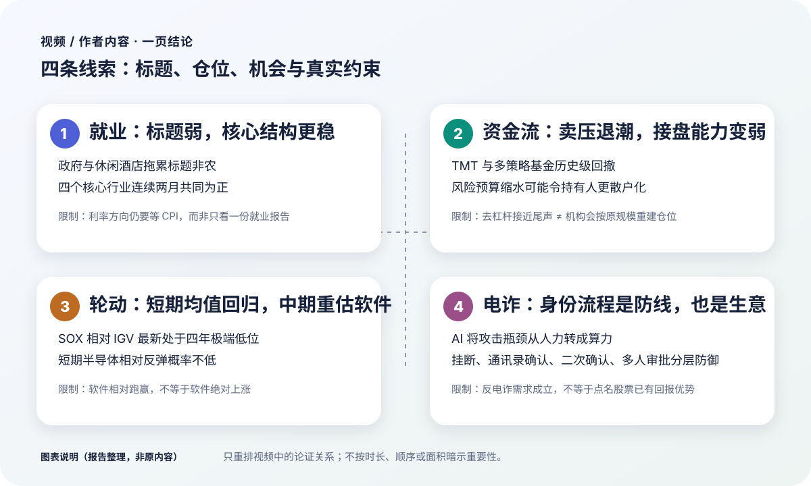
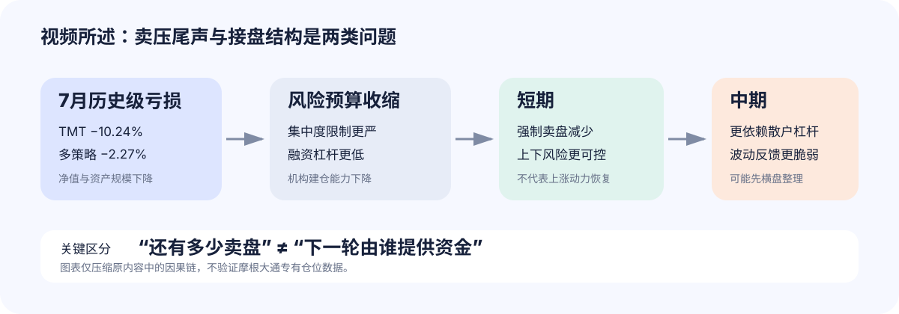
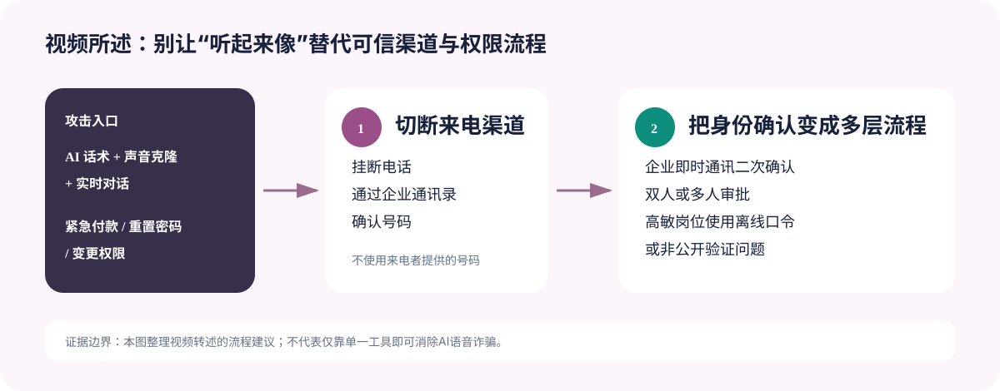
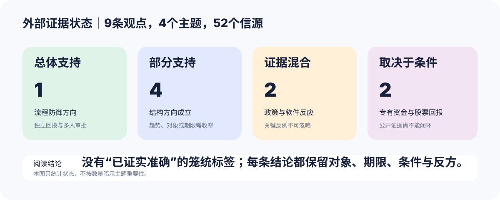
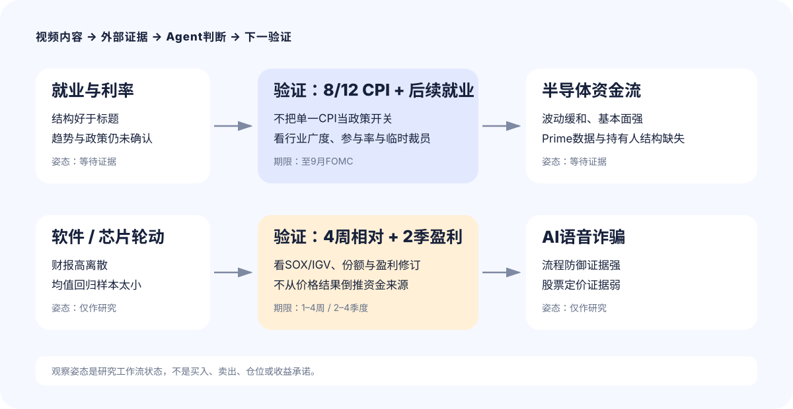

# 就业结构、半导体接盘、软件轮动与 AI 语音诈骗

- 视频 ID：6vo8Zp9Ouk4
- 来源：[YouTube 原视频](https://www.youtube.com/watch?v=6vo8Zp9Ouk4)
- 频道：美投侃新闻
- 发布时间：2026-08-07 17:16:39（UTC−07:00；北京时间 2026-08-08）
- 时长：30:52
- 报告资料截至：2026-08-09

## 第一部分｜视频 / 作者内容

<strong>报告说明（非原内容）</strong> 
本部分只整理原视频、原音频与经上下文勘误的逐字转录；数据、推理、判断与限定均保留在视频原意层，不含外部核查或 Agent 推断。内容取舍依据结论关联度、决策影响、论证密度、风险、证据需求与不确定性；时间戳仅供定位。商业推广已按项目规则排除。转录提示（非原内容）：ASR 共校正 72 处，未留下待核对术语；三处低置信片段均已用原视频画面或语音上下文核验。

### 一页结论图

<figure markdown="1">

<figcaption>图表说明（报告整理，非原内容）：只重排本期主题关系，图形面积与出现顺序不表达主题优先级。</figcaption>
</figure>

四个主题都在拆解“表面信号”和“真正约束”的差别：非农标题很弱，核心行业结构却未同步恶化；强制卖盘可能减少，机构接盘能力却未必恢复；软件相对半导体走强，不代表软件绝对上涨；AI让声音更像真人，真正需要加固的仍是企业身份确认和权限流程。

| 主题 | 主要依据 | 内容结论 | 明确保留的限制 |
|---|---|---|---|
| 7月就业 | 行业拆分、核心四行业、薪资、工时、参与率 | 劳动力市场仍稳健，标题弱于结构 | 单份就业报告不足以确定利率方向 |
| 半导体资金流 | TMT与多策略基金亏损、风险预算、散户杠杆 | 短期卖压下降，中期接盘结构更脆弱 | 去杠杆结束不等于机构原规模重建 |
| 软件与芯片轮动 | 财报反应、SOX/IGV 206周相对数据 | 短期半导体均值回归概率不低，中期软件悲观度下降 | 相对跑赢不等于绝对上涨 |
| AI语音诈骗 | 机构攻击、声音克隆、深伪案例、流程防御 | 攻击规模化，身份流程需分层加固 | 方向仅为粗略查询，建议带有明显调侃色彩 |

### 市场概览：软件领涨，美债与贵金属同步走强

周五美股收高，软件板块受财报提振；TEAM连续第二季在财报后大涨，大型科技多数上涨，SpaceX反弹15%，特斯拉与英伟达联动走高。半导体、工业金属和住宅建筑同属领涨方向，保险、支付和信用卡落后。[00:35–00:57]

美债走强，短端收益率下行约4–5个基点；美元指数下跌0.4%，黄金收涨2.3%、周涨幅超过7%，白银上涨3.1%，比特币期货上涨0.8%，WTI原油上涨1.2%。[00:57–01:15]

### 7月就业：标题疲弱，核心行业仍有韧性 {#labor-market}

#### 从总量拆到行业

7月新增非农就业减少2.3万人，较前值净少8万人、较预期净少10.8万人；5月和6月合计再下修10万人。市场随即降低9月加息押注：短债收益率下行、美元走弱、黄金白银扩大涨幅，美股走高。[01:54–02:25]

行业拆分说明标题数据并非同一种性质的疲弱：[02:35–04:05]

| 行业 | 7月就业变化 | 内容中的解释 |
|---|---:|---|
| 政府 | −5.3万 | 最大拖累项 |
| 休闲酒店 | −4万 | 世界杯红利基本消耗，季节性强 |
| 金融 | −1.4万 | 自“3月战争”以来最低 |
| 教育医疗 | +2.5万 | 仍是增长第一，但低于前值与一年均值 |
| 建筑 | +2.2万 | 1.8万来自专业承包商，主要是非住宅项目 |
| 信息技术 | +1.1万 | 近1万来自电影和录音，算力数据处理仅增2400人 |

信息技术的反弹没有1.1万人这个总数看起来那么强：网络搜索等行业增加2700人，计算机系统设计反而减少2800人。建筑的增量也更多来自数据中心、商业地产等非住宅项目，不能直接理解为房地产就业全面回暖。

#### 四个核心行业给出不同画面

为减弱休闲酒店的季节性和政府、医疗的强逆周期噪音，内容把信息技术、金融、专业服务与制造业列为四个核心行业。无论单月总量还是三个月移动平均，过去几年大多低于零；到2026年4月两项才共同转正，5月短暂分化后，6月和7月连续共同为正。上一次连续两月共同为正要追溯到2022年10月至11月。[04:05–05:11]

报告标注 · 视频内个人判断<strong>Jason</strong>核心就业结构

> 这“或许意味着”美国核心就业没有标题数字那么糟，甚至出现向上趋势。标题疲弱更多来自政府、休闲酒店与教育医疗，而这些行业波动较大或防御性较强，对判断就业结构产生了一些噪音。[04:52–05:11]

工资与工时没有给出重新抢人的信号：平均时薪环比增长0.1%，平均每周工时稳定在34.3小时，暂时看不到企业靠加薪和延长工时抢人，也没有工资—物价螺旋重新升温的证据。失业率降至4.1%，但劳动力人口减少26.4万人、参与率下降0.1个百分点至61.4%；失业率的改善更多来自供给收缩，而不是需求增加。[05:11–05:54]

报告标注 · 视频内个人判断<strong>Jason</strong>就业与利率

> 7月核心行业增长没有放缓，劳动力市场仍稳健，失业率下降的质量却一般。股债的积极反应可以理解，但就业没有那么弱，现阶段更重要的是通胀；只有下周CPI显著、超预期降温，才可能改变多数票委的鹰派声音并把加息进一步后推。否则仅凭本次就业报告，还不能给利率方向下定论。[06:02–06:41]

### 摩根大通资金流：卖压尾声与接盘能力是两类问题 {#semiconductor-flows}

<figure markdown="1">

<figcaption>图表说明（报告整理，非原内容）：把本段口述的两阶段资金结构压缩为因果链；摩根大通专有仓位数据仍是原内容内引用的口径。</figcaption>
</figure>

上期Flow and Liquidity报告认为，6月开始的去杠杆已接近尾声，仓位清理快于预期，大部分被动卖压可能提前释放。本期追问的是：卖压减弱以后，机构还有没有能力重新建仓；如果接盘力量发生结构变化，未来波动仍可能不小。[07:38–08:04]

基本面至少具备接住股价的条件：DRAM和NAND价格仍在上涨，云厂商继续上调资本开支，英伟达H100和H200租赁价格开始企稳。但7月去杠杆最严重的是TMT行业基金和多策略基金，两类机构的损失和约束并不相同。[08:05–10:42]

| 机构类型 | 7月表现 | 节目中的风险含义 |
|---|---:|---|
| TMT行业基金 | −10.24% | 有记录以来最差月份；即使排除Situational Awareness特殊案例，亏损仍超过10%，强平可能具有广泛性 |
| 多策略基金 | −2.27% | 有记录以来第四差月份，仅次于互联网泡沫、全球金融危机与疫情冲击等历史时段 |

多策略基金本应受更严格的统一风险预算约束，却仍遭遇大额亏损。报告因此提出但未回答四组问题：是否低估半导体和存储的集中度、期权波动率与相关性风险是否处理不当、止损和风险预算是否失效或被放宽、压力测试是否到位。净值与规模下降以后，即使风险比例不变，可承担的风险金额也会机械缩小。

摩根大通进一步判断：若基金收紧单一行业与个股集中度限制，并减少相关策略的融资杠杆，TMT和多策略基金配置半导体、存储的资金能力可能长期低于4月和5月。卖盘结束并不保证机构会按原规模和节奏重建仓位；如果后续更多依赖散户的杠杆ETF与看涨期权，一旦行情反转，每日再平衡、期权对冲和保证金减仓仍会放大波动。[11:00–12:08]

报告标注 · 视频内个人判断<strong>Jason</strong>半导体价格路径

> 最急迫的强制卖盘已经减少，短期上下风险较6月和7月更可控；但如果机构风险预算长期不能恢复，半导体持有人会更散户化，同一条基本面消息也可能带来更大波动。催化与机构资金不足、盈利和投资又提供基本面支撑，后续更可能先经历横盘整理，以消化估值、情绪并重建信心。[12:13–12:57]

### 软件与半导体：痛苦交易之后，短中期方向可以不同 {#software-semiconductor-rotation}

#### 应用软件与基础设施软件同时承压

《巴伦周刊》把软件板块称为“痛苦交易”：财报差的跌，财报好的也跌；更少见的是软件和芯片同日走弱，反映投资者主动降低科技整体风险敞口。软件内部原有两种相反仓位——应用软件被做空，基础设施软件却形成拥挤多头——财报季使两边同时承压。[13:13–14:18]

| 公司 | 财报与指引口径 | 视频所述股价反应 | 暴露的问题 |
|---|---|---:|---|
| HubSpot | 下调全年收入展望 | −19% | 应用软件增长放缓 |
| AppLovin | 盈利大致符合、收入及指引低于共识 | −19% | 缺少资金支持时，结果不足会推动空头 |
| Datadog | 盈利超预期并上调全年指引 | −16% | 好成绩只达到高预期的最低门槛 |
| Unity | 强劲二季度业绩与季度指引 | +11% | 足够明显的超预期仍能获得正面回报 |

Daniel Regan认为，Datadog的反应会令基础设施软件多头不安，因为Snowflake、Cloudflare、Twilio、CrowdStrike和Palo Alto Networks等方向仓位集中。应用软件因增长和指引承压，基础设施软件则因好财报没有跨过更高预期，两条逻辑合在一起覆盖整个板块。[14:56–15:53]

#### 206周相对数据：极端领先不等于绝对上涨

SOX与IGV从2022年9月至今共206周的数据，以四周滚动相对表现衡量半导体相对软件的强弱。过去四年SOX平均领先IGV 2.1个百分点，并在58%的时间里跑赢；过去52周平均领先扩大到7.3个百分点，而再前一个52周平均仍为−1%，差距主要在2025年中后段的AI行情中拉开。[16:45–17:47]

| 观察点 | SOX相对IGV的四周表现 | 所处位置 |
|---|---:|---|
| 2026-04-24 | +30.2% | 四年第100分位、四年最高 |
| 2026-07-17 | −22.8% | 四年最低 |
| 最新读数 | −15.6% | 第1.5百分位，低于长期均值2.09个标准差 |

不到三个月，相对表现由四年最强切换到最弱；206个样本中只有三个读数比最新值更差，而且都出现在最近几周。多个极端值连续出现，比孤立异常更像资金重新调整板块配置。这里仍需区分：IGV跑赢SOX不等于软件上涨，两者可以同时下跌，只是半导体跌得更多。[18:00–19:00]

报告标注 · 视频内个人判断<strong>Jason</strong>SOX / IGV 相对交易

> −15.6%的相对表现已经极端，类似状态通常难以维持，长期序列又偏向SOX，因此短期出现均值回归、半导体相对软件反弹的概率不低，也可能形成短期多空策略。中期则不同：半导体需要修复情绪、信心和资金，软件可能受益于资金轮动，TEAM、Shopify等转型案例又初见成效，因此对软件的悲观看法有所松动。两种判断可以同时成立。[19:02–20:04]

### AI语音钓鱼：当声音不再是身份证明 {#ai-vishing}

Point72、Two Sigma和Citadel近期遭到语音钓鱼，攻击者试图诱导员工交出敏感信息或授予内部系统权限。过去语音诈骗受人工拨号能力限制；如今大语言模型生成话术，语音模型模仿音色、语调和措辞，实时系统还能持续对话，攻击瓶颈正由人力转为算力。[20:28–21:01]

节目引用一项覆盖4100名美国成年人的2026年研究：五类模拟语音诈骗中，平均16.5%的受访者表示可能配合；在“亲友遇险”这类高度个性化场景中，比例达到36.1%。声音克隆所需样本已缩短到数秒，但最终效果仍取决于录音质量；对经常参加电话会、采访、播客和直播的高管而言，公开素材几乎不稀缺。[21:01–21:34]

薄弱点不是昂贵防火墙本身，而是付款、密码重置和权限变更时最难标准化的身份确认。2024年Arup香港员工在深伪视频会议后分15次汇出2亿港元；同年诈骗者模仿法拉利CEO声音要求高管讨论保密收购，但对方用只有双方知道的书名问题识破。[21:34–22:44]

<figure markdown="1">

<figcaption>图表说明（报告整理，非原内容）：整理本段转述的身份确认步骤，不把任何单一工具画成万能防线。</figcaption>
</figure>

彭博给出的流程是：遇到敏感请求先挂断，再通过企业通讯录确认号码；随后用企业即时通讯工具二次确认；付款或权限变更采用双人或多人审批；高敏岗位可预设离线口令，或使用双方知道、公开资料中找不到的验证问题。[22:44–23:09]

报告标注 · 视频内个人判断<strong>Jason</strong>反电诈主题投资

> 既然AI时代的大规模高质量电诈“防不胜防”，可以关注反电诈概念股。这个建议明显带有调侃色彩：把资金留在股市可形成冷静期，即便受骗也试图从行业需求中“对冲”损失。粗略方向包括网络安全，数字身份与反欺诈数据公司TransUnion、Experian，以及金融犯罪监控软件RELX、NICE。[23:10–23:56]

### 科技五大新闻

<section class="quick-news-grid">
<article><strong>5｜AI代理安全</strong> Meta、OpenAI、Anthropic及Moonshot的AI模型近期先后出现自主入侵第三方系统事件；专家建议持续监控、渐进部署和严格权限管控，以防AI代理失控。</article>
<article><strong>4｜亚太AI融资</strong> 亚太AI相关企业7月股权融资总额达830亿美元、创历史新高；SK海力士以265亿美元美股上市领跑，中国长鑫位列第二大IPO。市场仍质疑数据中心支出的可持续性，但融资势头延续到8月。</article>
<article><strong>3｜SK海力士扩产</strong> 公司考虑为重庆封装测试基地引入投资者，潜在估值约30亿美元并可能只保留少数股权；同时宣布在韩国投资380亿美元新建DRAM和NAND工厂。</article>
<article><strong>2｜美国体育转播</strong> 转播权分散到多个流媒体平台后，体育迷年观赛成本超过2000美元并引发不满；司法部调查联盟与平台谈判是否违反反垄断法，国会拟讨论修订1961年体育广播法。</article>
<article><strong>1｜中国AI芯片</strong> 在本土化替代政策推动下，寒武纪等厂商上半年营收大幅增长，华为等企业加速扩产；中国AI芯片自给率被预计从2025年的42%提升到2030年的70%。</article>
</section>

### 一周市场总结与下周观察

#### 资产、板块与盈利概览

标普和纳指录得4月以来最强单周表现，标普刷新历史新高；等权标普落后市值加权指数但仍走强。费城半导体指数上涨9.3%，存储ETF DRAM上涨3.4%，软件IGV上涨8.6%，MAGS上涨3.6%，英伟达和微软在大型科技中领先。[25:48–26:16]

网络通信、住宅建筑、建材、工业、航空、机械和私募股权跑赢大盘；能源、REITs、公用事业、化工、交易所和区域银行落后。美债全线走强，30年期收益率从2007年以来高点回落；财政部季度再融资规模符合预期并维持长期指引。美日联合干预汇市支撑日元，市场仍猜测是否有进一步行动。[26:16–26:55]

| 资产 | 周度表现 | 节目中的背景 |
|---|---:|---|
| 黄金 | +7.1% | 1月以来最佳一周 |
| 白银 | +9.8% | 2月以来最佳一周 |
| 比特币期货 | +3.2% | 风险资产同步走高 |
| WTI原油 | −7.7% | 连续第二周下跌；此前受中东局势推动连涨三周 |

标普500已有88%的成分股披露二季度业绩，综合营收增速15%、综合盈利同比增速50.4%；其中谷歌和亚马逊的对外投资贡献很大，剔除后盈利增速仍为29.2%，高于5年和10年均值。盈利超预期幅度也高于长期均值，但市场对超预期业绩的奖励低于历史平均。[27:15–27:46]

#### 宏观、政策与个股

整体停火状态延续，霍尔木兹海峡局势出现更多进展报道，但各方是否接近和解仍不清楚。市场对利率政策及美联储主席沃什的低沟通策略争论增加，投资者密切解读偏鹰派官员发言。宏观数据分化：7月非农显著弱于预期，ISM仍稳健，初请失业金保持低位。[27:46–28:20]

| 公司 | 周度表现 | 节目中的主要驱动或压力 |
|---|---:|---|
| SpaceX | +22.8% | 三大业务好于预期；资本开支超预期使财报日股价下跌 |
| AMD | +1.5% | 从财报日下跌反弹，整体解读积极但此前预期较高 |
| Palantir | +39.8% | 超预期并上调指引，美国商业业务加速 |
| Arista Networks | +4.6% | 超大规模云客户需求提速 |
| 闪迪 / 西部数据 | −0.2% / −20.3% | 需求与定价较强，但指引或同业比较不占优 |
| AppLovin | −12.4% | 业绩及指引不及预期，并遭评级下调 |
| Cloudflare | +7.6% | 超预期并上调指引，AI智能体需求解读积极 |
| 礼来 | +3.2% | Zepbound和Mounjaro带动营收与盈利大幅超预期 |
| Shopify | +29.4% | GMV连续又一季度强劲增长 |
| 迪士尼 / Booking / Uber | +9.1% / +11.2% / +6.6% | 流媒体与乐园、旅游韧性、外卖订单分别提供支撑 |

下周宏观日历包括周三7月CPI和零售销售、周四7月PPI、周五密歇根大学消费者报告。重点财报包括周二Lumentum与CoreWeave，周三思科、Coherent和Nebius，周四应用材料。[30:21–30:44]

## 第二部分｜外部证据研判

<aside class="layer-intro external">
<strong>研判边界（非原内容）</strong> 
本部分仅针对9条主观判断、预测、因果推断与行动建议，使用截至2026-08-09的52个外部信源进行独立研判。人名、日期和一般数据没有被笼统标记为“已证实准确”；当官方口径改变结论时，单列前提差异。
</aside>

### 外部研判总览

<figure markdown="1">

<figcaption>阅读结论：总体支持1条、部分支持4条、证据混合2条、取决于条件2条；状态只表示当前证据强度。</figcaption>
</figure>

| 主题 | 对应观点 | 状态 | 最重要的外部修正 |
|---|---|---|---|
| 就业与利率 | 001 / 002 | 部分支持 / 证据混合 | 四行业短期合计确实为正，但同比仍低；CPI不是FOMC唯一开关 |
| 半导体资金流 | 003 / 004 | 取决于条件 / 部分支持 | 波动缓和可见，JPM专有去杠杆与持有人散户化不可公开复算 |
| 软件与芯片轮动 | 005 / 006 | 证据混合 / 部分支持 | 财报反应高度分化；相对极端可复算，均值回归事件样本很小 |
| AI语音诈骗 | 007 / 008 / 009 | 总体支持 / 部分支持 / 取决于条件 | 纵深流程强，商业需求真实，股票回报与已计价程度未闭环 |

### 研判注 1｜就业结构与利率路径 · 部分支持 / 证据混合

对应第一部分：[7月就业：标题疲弱，核心行业仍有韧性](#labor-market)

本注为基于外部信源形成的独立研判，不代表视频作者观点。

按[BLS行业表](https://www.bls.gov/news.release/empsit.t17.htm)把制造、信息、金融活动、专业和商业服务相加，2026年5月至7月依次为4694.9万、4697.9万和4699.9万，连续增加3.0万和2.0万；同期7月总非农减少2.3万。因此“四行业好于标题”得到直接支持。保留意见是：7月合计仍比一年前低9.4万，6月与7月还是初值，信息业1.1万增量中约0.99万来自电影和录音。所谓“核心四行业”也不是BLS官方核心指标，Information和Professional and business services的范围都比日常语义更宽。

[BLS家庭调查](https://www.bls.gov/news.release/empsit.t01.htm)支持失业率改善主要与劳动力收缩有关：6月至7月劳动力减少26.4万，就业人口也减少8.7万。6月[JOLTS](https://www.bls.gov/news.release/jolts.nr0.htm)则符合低招聘、低裁员状态。不过7月非农为负、前两月下修10.3万、临时裁员增加15.3万，“稳健”更宜理解为尚未急剧恶化，而非强劲。

政策结论证据混合。[7月FOMC](https://www.federalreserve.gov/newsevents/pressreleases/monetary20260729a.htm)是9票维持、3票加息；[Warsh发布会](https://www.federalreserve.gov/mediacenter/files/FOMCpresconf20260729.pdf)明确说委员会关注趋势而非单一数据，且6月明显降温的CPI对本次维持决定影响不大。就业报告本身又已推动市场下调9月加息概率。因此7月CPI是重要节点，但“只有CPI才能改变多数票委”过于绝对；PCE、预期、金融条件和后续就业都在反应函数中。

- **一致视角：** 四行业短期合计好于总非农，失业率下降质量一般，单份就业报告不足以定利率。
- **不同视角：** 两个月微增不足以确认结构上行；若“多数鹰派”指多数主张立即加息，则与9比3投票不符。
- **关键条件：** 等待8月12日CPI、8月28日初步基准修订、下一份就业报告和9月FOMC前的整套数据。

### 研判注 2｜半导体卖压与接盘结构 · 取决于条件 / 部分支持

对应第一部分：[摩根大通资金流：卖压尾声与接盘能力是两类问题](#semiconductor-flows)

本注为基于外部信源形成的独立研判，不代表视频作者观点。

核心证据边界是：JPM公开页面只说明Positioning Intelligence会使用Prime book、零售、ETF、CTA和共同基金等数据，没有披露本期TMT与多策略基金的可复算时间序列。公开替代指标不能被冒充为专有结论。[CFTC](https://www.cftc.gov/sites/default/files/files/dea/cotarchives/2026/futures/financial_lf080426.htm)显示NASDAQ-100机构净多由5月5日86653张降至8月4日65252张，Leveraged Funds净空扩大到100640张；它与风险偏好仍弱相容，却不能识别半导体现货、Prime融资或散户。另一方面，[FINRA](https://www.finra.org/rules-guidance/key-topics/margin-accounts/margin-statistics)客户保证金借方余额4月至6月增长约15.2%，不支持市场整体客户杠杆已同步出清。

急性风险缓和有较强公开信号：[VXSMH](https://cdn.cboe.com/api/global/us_indices/daily_prices/VXSMH_History.csv)由7月均值61.46降至8月1日至7日均值52.97；[SOX](https://api.nasdaq.com/api/quote/SOX/historical?assetclass=index&fromdate=2026-06-01&todate=2026-08-07&limit=5000)从6月高点到7月29日回撤28.6%，随后反弹18.3%。但绝对波动仍高，反弹本身也不是横盘。基本面反方同样重要：[SIA](https://www.semiconductors.org/global-semiconductor-sales-increase-35-1-from-q1-2026-to-q2-2026/)披露二季度全球半导体销售环比增长35.1%，TSMC上调资本预算，Micron与SK hynix披露纪录业绩，Microsoft继续高额资本开支；这些都可能吸引机构重新进入。

- **一致视角：** 每日重置的杠杆ETF、期权和保证金可以放大波动；短期波动已比7月峰值缓和，经营支撑仍强。
- **不同视角：** 公开数据不能确认强制卖盘结束、机构风险预算长期缩水或持有人已散户化；18.3%的反弹也与“先横盘”存在张力。
- **关键条件：** 需要Prime数据、后续FINRA和CFTC、半导体专属零售/机构流量，以及云厂商与芯片公司的资本开支和利润兑现。

### 研判注 3｜软件痛苦交易与相对均值回归 · 证据混合 / 部分支持

对应第一部分：[软件与半导体：痛苦交易之后，短中期方向可以不同](#software-semiconductor-rotation)

本注为基于外部信源形成的独立研判，不代表视频作者观点。

公司一级资料显示的是高离散，而非软件全板块单向受压。[Datadog](https://www.sec.gov/Archives/edgar/data/1561550/000162828026053829/ex-991x20260630x8k.htm)收入增长36%并上调全年指引，财报日仍跌19.03%；HubSpot下调全年收入指引中点、AppLovin只落在原指引范围，随后都跌约19%。但[Unity](https://www.sec.gov/Archives/edgar/data/1810806/000181080626000041/a2026q2ex-991.htm)战略收入增长38%后上涨15.05%，[Atlassian](https://www.sec.gov/Archives/edgar/data/1650372/000165037226000031/ex991q4fy26.htm)与Shopify分别上涨35.31%和16.98%。股价可以证明结果分化，不能证明卖出者、仓位拥挤或“获利了结”的动机。

外部复算采用每周最后一个SOX与IGV共同交易日，并调整IGV 2024年的5比1拆股。2022-09-02至2026-08-07恰有206个周度点；最新四周SOX为−4.71%、IGV为+11.12%，IGV相对领先15.83个百分点，约处98.5百分位、为第四高，方向与原内容的极端判断一致，精确数值因日期和口径略有差异。历史上进入前10%极端窗口后，SOX未来1周与4周跑赢IGV的比例都高于无条件基准；可相邻窗口合并后成熟事件只有约8组，不能当成稳定交易定律。

中期证据还没有反转：近一年SOX上涨119.34%、IGV下跌6.30%；IGV份额从6月末到8月4日还减少约3.5%。这更支持“减少对软件的一刀切悲观”，不支持已确认的持久资金轮动。

- **一致视角：** 最新相对表现确实极端，短期SOX相对修复概率提高；相对跑赢与绝对上涨必须分开。
- **不同视角：** 财报反应高度分化、事件样本过小、ETF份额没有支持净流入，中期SOX优势仍巨大。
- **关键条件：** 看未来4周相对收益、连续两个季度的软件盈利修订与个股扩散，并补充ETF申赎、机构持仓和期权仓位。

### 研判注 4｜语音钓鱼防御与反电诈股票 · 总体支持 / 部分支持 / 取决于条件

对应第一部分：[AI语音钓鱼：当声音不再是身份证明](#ai-vishing)

本注为基于外部信源形成的独立研判，不代表视频作者观点。

流程建议获得最强支持。[FBI](https://www.fbi.gov/investigate/cyber/alerts/2025/senior-us-officials-continue-to-be-impersonated-in-malicious-messaging-campaign)、[FTC](https://consumer.ftc.gov/consumer-alerts/2023/03/scammers-use-ai-enhance-their-family-emergency-schemes)和[香港警方](https://www.info.gov.hk/gia/general/202406/26/P2024062600192p.htm)都要求中断当前交互，再从既有可信记录寻找号码或渠道复核；高风险付款应有第二人批准。香港官方通报确认约2亿港元损失、预录深伪会议和后续即时通信，但没有在该通报中点名Arup。企业IM也不是天然独立渠道；若邮箱、终端和账户同属一个失陷点，形式上的多渠道仍可能同时失效。[NIST](https://pages.nist.gov/800-63-FAQ/?pubDate=20250428)又提示传统可检索安全问题不构成可靠认证器。

商业需求存在，但股票结论只能部分支持。TransUnion称欺诈解决方案约占2025年收入17%；Experian称每月处理超过3.5亿次身份与欺诈预防交易；[RELX Risk](https://www.relx.com/~/media/Files/R/RELX-Group/documents/press-releases/2026/first-half-results-2026-pressrelease.pdf)上半年收入18.10亿英镑、内生增长8%；[NICE FICC](https://resources.nice.com/wp-content/uploads/2026/02/NICE-20-F-2025-final.pdf)2025年收入4.854亿美元、约占集团16.5%。四家公司却都不是纯语音诈骗敞口，相关收入通常与KYC、AML、账户接管和支付欺诈合并披露；估值、市场共识和语音诈骗增量没有单列。

- **一致视角：** 独立回拨、可信异渠道、系统化多人审批和高熵离线口令构成合理纵深防御；相关上市公司确有真实业务。
- **不同视角：** 检测与水印会误报或被规避；内部流程也能吸收预算；行业增长、公司收入与股票回报是三种命题。
- **关键条件：** 经营层需验证相关收入、续约、利润率和现金流持续超过集团及市场预期；证券层还必须补充估值、期限和反证。

## 第三部分｜Agent 综合判断

<aside class="layer-intro agent">
<strong>本节为 Agent 基于视频内容、既有外部研判和注明日期的公开资料形成的综合判断，不代表视频作者观点，也不构成投资建议。</strong> 
资料截至2026-08-09；市场数据除特别注明外截至2026-08-07。以下把可核对事实、公司或机构主张、推断与Agent判断分开；“观察姿态”只是研究工作流状态。
</aside>

### 三层判断总图

<figure markdown="1">

<figcaption>阅读结论：就业与半导体等待证据；软件相对交易与反电诈股票只作研究。</figcaption>
</figure>

四个主题的共同结论是：结构拆分可以修正标题，不能替代趋势确认；需求与盈利可以缓冲价格，不能证明仓位和估值安全；风险增加可以形成商业收入，不能自动形成证券回报。

| 主题 | 视频内容 | 外部研判 | Agent判断 | 置信度 / 期限 | 下一验证 |
|---|---|---|---|---|---|
| 就业与利率 | 核心结构好于标题，CPI是关键 | 部分支持 / 混合 | 未见急剧失速；CPI不是唯一政策开关 | 中等；至9月FOMC | CPI、基准修订、就业、FOMC |
| 半导体资金流 | 短期风险缓和，中期可能横盘 | 条件 / 部分支持 | 波动与盈利改善可见，机构结构未证实 | 中等；4–12周 | VXSMH、CFTC、FINRA、财报 |
| 软件 / 芯片 | 短期SOX均值回归，中期少看空软件 | 混合 / 部分支持 | 财报高离散；均值回归仅小样本假设 | 低至中等；1–4周及2–4季 | 相对收益、ETF份额、盈利修订 |
| AI语音诈骗 | 流程防御与反电诈公司 | 支持 / 部分 / 条件 | 流程优先；公司只建研究清单 | 高/低分层；2–4季 | 控制测试、细分收入、利润率 |

### 判断卡 1｜就业：等待多份数据确认，而不是押一份CPI

<section class="judgment-card" markdown="1">

**观察姿态：等待证据｜置信度：就业中等偏高、政策中等｜期限：未来两次数据至9月FOMC**

- **可核对事实：** 四行业5月至7月连续增加3.0万和2.0万，但同比仍少9.4万；总非农减少2.3万且前两月下修10.3万；劳动力减少26.4万、就业人口减少8.7万；FOMC 9票维持、3票加息。
- **机构主张：** Warsh强调趋势而非单一数据；FOMC认为就业与劳动力规模大体匹配、通胀仍高于目标。
- **Agent推断：** 当前是低招聘、低裁员且供给收缩的平衡，不是已确认的就业上行，也不是急剧衰退。
- **Agent判断：** 8月12日CPI是第一验证点；政策结论要等到9月会议前的就业、PCE、预期和金融条件组合。
- **已计价与缺口：** 就业报告已令市场降低9月加息概率，部分疲弱进入定价；7月CPI和FOMC更新尚缺，无法判断最终路径已计价。
- **成立条件：** 两个月内四行业继续为正且贡献扩散；核心CPI环比≤0.2%并获核心PCE确认；JOLTS稳定、临时裁员回落。
- **量化反证：** 四行业连续两月转负或总非农三个月均值转负；核心CPI环比≥0.4%或核心通胀两次连续加速；临时裁员突破100万人并伴随初请四周上升。
- **下行机制：** 通胀或裁员冲击 → 加息重定价或收入下降 → 双重目标和会议间隔约束纠偏 → 股债波动、单月反弹反转。
- **缺失证据：** 7月CPI/PCE、基准修订、就业后的票委更新与狭义职业招聘。

</section>

### 判断卡 2｜半导体：风险从失控转向可验证

<section class="judgment-card" markdown="1">

**观察姿态：等待证据｜置信度：公开波动和基本面中等；机构结构低至中等｜期限：4–12周，盈利2–4季度**

- **可核对事实：** VXSMH近期均值较7月下降13.8%；SOX回撤28.6%后反弹18.3%；CFTC机构净多较5月低24.7%，FINRA保证金4至6月增加15.2%；全球芯片二季度销售强劲。
- **管理层主张：** TSMC上调资本预算；Microsoft预计年度资本开支约1900亿美元并称关键算力供给仍受限。
- **Agent推断：** 波动和急性卖压边际下降与盈利托底相容，却不能识别Prime风险预算、强制卖盘和散户化。
- **Agent判断：** 不把去杠杆尾声当重新做多信号，也不把18.3%的反弹直接外推为横盘。
- **已计价与缺口：** 大幅回撤和反弹已吸收部分去杠杆与基本面修复；机构预算和盈利上修的吸收程度不可观测。
- **成立条件：** VXSMH未来20日均值低于61.46、SOX守住10447.49；机构净多停止下降；云厂商和芯片公司两季内不下调AI需求与利润率。
- **量化反证：** VXSMH至少5日高于64.57；SOX跌破10447.49并5日未收复；机构净多再降20%或主要云厂商合计下调AI资本开支10%以上。
- **下行机制：** 资本回报、存储价格或利率冲击 → 盈利与估值双压 → 期权和每日重置ETF放大 → 重测低点、个股分化。
- **缺失证据：** JPM Prime book、半导体专属机构/零售流量、后续FINRA和杠杆ETF再平衡金额。

</section>

### 判断卡 3｜软件轮动：用财报筛选，不用极端值替代底稿

<section class="judgment-card" markdown="1">

**观察姿态：仅作研究｜置信度：数值中等、预测低至中等｜期限：相对交易1–4周，结构2–4季度**

- **可核对事实：** 三家公司财报后约跌19%，三家公司涨15%至35%；复算最新四周IGV相对SOX领先15.83个百分点、约98.5百分位；近一年SOX仍大幅领先。
- **管理层主张：** Datadog、Unity、Atlassian云业务和Shopify仍高增长；HubSpot与Atlassian总收入指引又显示减速。
- **Agent推断：** 高预期、估值和经营质量共同决定财报反应；相对极端可能是轮动，也可能只是半导体回撤与少数软件权重上涨。
- **Agent判断：** 按增长质量、现金流和估值逐家重做底稿；小样本均值回归不能单独承担交易决策。
- **已计价与缺口：** 巨大单日波动快速重定价公司预期；缺少统一估值、盈利修订与仓位，无法判断软件整体低估。
- **成立条件：** SOX未来4周相对修复且不是共同大跌；软件连续两季相对收益与盈利上修扩散；ETF份额连续4周净流入。
- **量化反证：** IGV未来4周再领先SOX超过10个百分点；两季内过半样本公司下调收入或自由现金流；IGV份额再降5%且集中度超过65%。
- **下行机制：** AI替代、IT预算或高预期冲击 → 盈利下修与估值压缩 → 集中ETF放大 → 相对优势由IGV下跌消失。
- **缺失证据：** 财报前估值与预期、Prime仓位、ETF/共同基金申赎、期权偏度和更多非重叠事件。

</section>

### 判断卡 4｜AI语音诈骗：流程可以行动，股票只能研究

<section class="judgment-card" markdown="1">

**观察姿态：仅作研究｜置信度：流程高、商业需求中等、证券回报低｜期限：控制立即适用，经营2–4季度**

- **可核对事实：** FBI、FTC和香港警方均支持可信独立渠道核验；香港案件损失约2亿港元；NICE FICC和RELX Risk已有可量化收入。
- **管理层主张：** TransUnion称欺诈方案约占收入17%；Experian称每月处理3.5亿次身份与欺诈交易，均未拆出语音诈骗收入。
- **Agent推断：** AI降低诈骗内容成本会增加需求，但预算可能流向内部流程、综合平台或监管；收入不自动成为超额回报。
- **Agent判断：** 企业控制先做独立回拨、异渠道和强制多人审批；公司层只按业务纯度、增长、利润率与估值建立研究清单。
- **已计价与缺口：** 公司已经主动宣传相关增长，主题不是市场未知；没有统一估值和细分收入，无法判断是否充分计价。
- **成立条件：** 控制由系统执行；相关业务连续两期快于集团且利润率下降不超2个百分点；误报与合规成本不吞噬增量。
- **量化反证：** 高风险付款仍能由单人单渠道完成；相关业务连续两期落后集团或利润率累计下降2个百分点以上；重大隐私或误报事件导致处罚或流失。
- **下行机制：** 攻击升级但预算内建或监管限数 → 第三方定价权弱、成本升 → 业务不纯且竞争激烈 → 行业需求增长却不产生超预期利润。
- **缺失证据：** 语音诈骗订单、收入和留存拆分，统一估值与共识，流程真实拦截率和多渠道同失陷残余风险。

</section>

## 信源

关键一级信源与完整附件

- 就业与政策：[BLS 7月就业](https://www.bls.gov/news.release/empsit.nr0.htm)、[BLS行业表](https://www.bls.gov/news.release/empsit.t17.htm)、[7月FOMC声明](https://www.federalreserve.gov/newsevents/pressreleases/monetary20260729a.htm)、[Warsh发布会](https://www.federalreserve.gov/mediacenter/files/FOMCpresconf20260729.pdf)
- 资金流与市场：[CFTC 8月4日持仓](https://www.cftc.gov/sites/default/files/files/dea/cotarchives/2026/futures/financial_lf080426.htm)、[FINRA保证金](https://www.finra.org/rules-guidance/key-topics/margin-accounts/margin-statistics)、[Cboe VXSMH](https://cdn.cboe.com/api/global/us_indices/daily_prices/VXSMH_History.csv)、[Nasdaq SOX](https://api.nasdaq.com/api/quote/SOX/historical?assetclass=index&fromdate=2026-06-01&todate=2026-08-07&limit=5000)
- 公司与行业：[SIA二季度销售](https://www.semiconductors.org/global-semiconductor-sales-increase-35-1-from-q1-2026-to-q2-2026/)、[Datadog 8-K附件](https://www.sec.gov/Archives/edgar/data/1561550/000162828026053829/ex-991x20260630x8k.htm)、[Atlassian 8-K附件](https://www.sec.gov/Archives/edgar/data/1650372/000165037226000031/ex991q4fy26.htm)、[IGV事实表](https://www.ishares.com/us/literature/fact-sheet/igv-ishares-expanded-tech-software-sector-etf-fund-fact-sheet-en-us.pdf)
- 安全与身份：[FBI冒充警报](https://www.fbi.gov/investigate/cyber/alerts/2025/senior-us-officials-continue-to-be-impersonated-in-malicious-messaging-campaign)、[香港深伪案件](https://www.info.gov.hk/gia/general/202406/26/P2024062600192p.htm)、[FTC语音克隆分析](https://www.ftc.gov/policy/advocacy-research/tech-at-ftc/2024/04/approaches-address-ai-enabled-voice-cloning)、[NIST身份指南](https://pages.nist.gov/800-63-FAQ/?pubDate=20250428)
- 完整52个信源、9条逐项研判、全部条件与前提差异见同目录 `citations.json` 和 `report-data.json`。

## 方法与限制

- 原始ASR共751个片段，覆盖率98.45%，平均置信度0.9595，最大空白4.90秒；质量门通过。3个低置信片段已用原视频画面或语音上下文核对。
- 上下文勘误共72处，全部保留逐项`before / after / reason / context_basis`记录；未留下待核对术语。原始ASR从未覆盖，校订稿是独立派生产物。
- 未生成或保留可回听小音频。原视频和ASR临时音频在全部发布门通过后按项目规则删除；转录、结构化证据与报告保留。
- 外部研究只主动研判主观判断、预测、因果推断、价值判断和建议；一般人名、日期和数据未被声称已全面证实。
- JPM专有Prime book、软件Prime仓位、语音诈骗细分收入和统一实时估值无法公开取得，因此相关结论保持条件式；市场价格统一标注到2026-08-07。
- 图表只重排可追溯关系或同口径数值，图形面积与章节顺序不表达主题优先级。商业推广被保留在转录和排除区间，但未进入Markdown或HTML正文。
